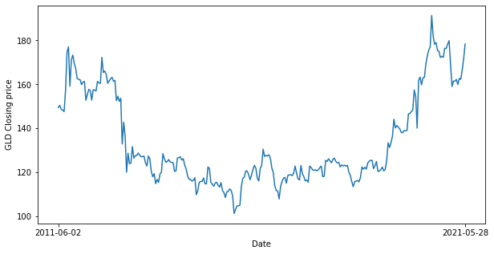
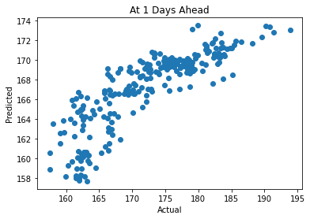

# Predicting GLD Close Price
   The aim of this notebook is to predict the closing price of the GLD ETF, which tracks the price of gold. We will utilize additional financial data sets that track factors (inflation and the price of silver) that may have an impact on the price of gold. We will also impute technographic metrics regarding the GLD ETF. Finally, we will train both a random forest model with access to increasing quantities of past data that aims to predict the next day's closing price and a neural network that aims to predict closing prices of the next ten days and compare which tool is more valuable.


```python
%%capture
#Installing PySpark, TensorFlow and Keras

!pip install pyspark==2.4.5
!pip install tensorflow==2.2.0rc0
!pip install keras
```


```python
#Importing necessary libraries

import tensorflow as tf
from tensorflow import keras
from pyspark import SparkContext, SparkConf
from pyspark.ml import Pipeline
from pyspark.ml.evaluation import RegressionEvaluator
from pyspark.ml.feature import MinMaxScaler as PySparkScaler
from pyspark.ml.feature import VectorAssembler
from pyspark.ml.regression import RandomForestRegressor
from pyspark.ml.stat import Correlation
from pyspark.sql import SparkSession
import pyspark.sql.functions as func
from pyspark.sql.types import DateType, LongType
from pyspark.sql.window import Window
from sklearn.preprocessing import MinMaxScaler
import os, types
import pandas as pd
import numpy as np
import matplotlib.pyplot as plt
from botocore.client import Config
import seaborn as sns
import ibm_boto3

def __iter__(self): return 0
%matplotlib inline
```


```python
#Creating SparkSession
sc = SparkContext.getOrCreate(SparkConf().setMaster("local[*]"))
spark = SparkSession.builder.getOrCreate()
```


```python
# @hidden_cell
# The following code accesses a file in your IBM Cloud Object Storage. It includes your credentials.
# You might want to remove those credentials before you share the notebook.

if os.environ.get('RUNTIME_ENV_LOCATION_TYPE') == 'external':
    endpoint_4e01311f4f2843c990fcef1b3c6308f8 = 'https://s3-api.us-geo.objectstorage.softlayer.net'
else:
    endpoint_4e01311f4f2843c990fcef1b3c6308f8 = 'https://s3-api.us-geo.objectstorage.service.networklayer.com'

client_4e01311f4f2843c990fcef1b3c6308f8 = ibm_boto3.client(service_name='s3',
    ibm_api_key_id='CM7M0h5W6OV5JKMLE6W_8hnYgNju8uJzkVZyqXSYiIcu',
    ibm_auth_endpoint="https://iam.cloud.ibm.com/oidc/token",
    config=Config(signature_version='oauth'),
    endpoint_url=endpoint_4e01311f4f2843c990fcef1b3c6308f8)

```

## Initial Data Exploration

## Loading the First of Three Datasets
GLD ETF Historical Financial Information as sourced from NASDAQ. This tracks the price of gold, our target will be the Closing price.


```python
#Taken from NASDAQ, this dataset contains historical information regarding trading of the GLD ETF, which tracks the price of gold

body = client_4e01311f4f2843c990fcef1b3c6308f8.get_object(Bucket='default-donotdelete-pr-yqa0kkyo06eppr',Key='GLD-0530.csv')['Body']
# add missing __iter__ method, so pandas accepts body as file-like object
if not hasattr(body, "__iter__"): body.__iter__ = types.MethodType( __iter__, body )

df = pd.read_csv(body)
print(df.head(20))
GLDdf = spark.createDataFrame(df)
GLDdf.printSchema()
#Data types are aligned with expectations. This indicates no unexpected incongruous data types.
```

              Date  Close/Last    Volume     Open      High       Low
    0   05/28/2021      178.38   9968324  177.460  178.4300  177.2411
    1   05/27/2021      177.71   7992951  177.390  177.8200  176.8100
    2   05/26/2021      177.64   8495383  178.368  178.6100  177.0400
    3   05/25/2021      177.95   8986945  176.150  177.9500  176.0400
    4   05/24/2021      176.35   5557339  176.150  176.5900  175.8700
    5   05/21/2021      176.04   7677190  176.580  176.8602  175.1450
    6   05/20/2021      175.96   9802799  175.320  176.4600  175.1100
    7   05/19/2021      175.16  20741110  175.140  177.0000  174.3450
    8   05/18/2021      175.04   7294010  175.180  175.2100  174.4600
    9   05/17/2021      174.70  11940700  173.300  175.0000  173.2800
    10  05/14/2021      172.69   9686777  172.050  172.7000  171.8200
    11  05/13/2021      171.13   8078266  170.350  171.2700  170.2250
    12  05/12/2021      170.43  12666260  171.432  171.8350  170.3450
    13  05/11/2021      172.14   8348213  170.558  172.1700  170.2700
    14  05/10/2021      172.11   8276584  172.740  172.8400  171.7800
    15  05/07/2021      171.59  14748630  171.530  172.5501  171.0000
    16  05/06/2021      170.06  13574070  167.950  170.2900  167.9200
    17  05/05/2021      167.27   3174181  166.630  167.3100  166.6100
    18  05/04/2021      166.58  10267410  167.690  168.5500  165.5000
    19  05/03/2021      167.81   9014708  167.610  168.4300  167.4100
    root
     |-- Date: string (nullable = true)
     |-- Close/Last: double (nullable = true)
     |-- Volume: long (nullable = true)
     |-- Open: double (nullable = true)
     |-- High: double (nullable = true)
     |-- Low: double (nullable = true)
    
    


```python
#Checking cursory measures for first data set.
GLDdf.createOrReplaceTempView('df')
spark.sql('SELECT MIN(`Close/Last`), AVG(`Close/Last`), MAX(`Close/Last`) FROM df').show()
spark.sql('SELECT MIN(Volume), AVG(Volume), MAX(Volume) FROM df').show()
spark.sql('SELECT MIN(Open), AVG(Open), MAX(Open) FROM df').show()
spark.sql('SELECT MIN(High), AVG(High), MAX(High) FROM df').show()
spark.sql('SELECT MIN(Low), AVG(Low), MAX(Low) FROM df').show()
#None of these measures are unreasonably high or low, this indicates that our data may not have improperly captured outliers.
```

    +---------------+------------------+---------------+
    |min(Close/Last)|   avg(Close/Last)|max(Close/Last)|
    +---------------+------------------+---------------+
    |          100.5|135.34962133492238|         193.89|
    +---------------+------------------+---------------+
    
    +-----------+-----------------+-----------+
    |min(Volume)|      avg(Volume)|max(Volume)|
    +-----------+-----------------+-----------+
    |    1501552|9544623.959872864|   93694690|
    +-----------+-----------------+-----------+
    
    +---------+------------------+---------+
    |min(Open)|         avg(Open)|max(Open)|
    +---------+------------------+---------+
    |   100.92|135.36105872069925|   193.74|
    +---------+------------------+---------+
    
    +---------+------------------+---------+
    |min(High)|         avg(High)|max(High)|
    +---------+------------------+---------+
    |   100.99|135.95765991259412| 194.4499|
    +---------+------------------+---------+
    
    +--------+-----------------+--------+
    |min(Low)|         avg(Low)|max(Low)|
    +--------+-----------------+--------+
    |100.2326|134.7092237981724|192.5207|
    +--------+-----------------+--------+
    
    


```python
#Generating Closing Price Run Chart Arrays

#Creating a column with date formatted as YYYY-MM-DD, so that ordering in SQL will be carried out properly.
#This will also create fidelity with the third dataset and facilitate converting to datetime format in cleansing.
def YMDDateReformat(x):
    oldDate = x[0]
    oldDate = oldDate.split('/')
    newDate = oldDate[2]+"-"+ oldDate[0]+"-"+ oldDate[1]
    return newDate, x[1],x[2],x[3],x[4],x[5]

GLDdf = GLDdf.rdd.map(lambda x: YMDDateReformat(x)).toDF(['Date','Close','Volume','Open','High','Low'])
GLDdf.show()

GLDdf.createOrReplaceTempView('df')

result = spark.sql('SELECT Date, Close FROM df Order BY Date ASC')
#Sampling from result to reduce the number of points plotted
resultRdd = result.rdd.sample(False,0.1).map(lambda row:(row.Date, row.Close))
gldDateResultArray = resultRdd.map(lambda Date_Close: Date_Close[0]).collect()
gldCloseResultArray = resultRdd.map(lambda Date_Close: Date_Close[1]).collect()
```

    +----------+------+--------+------------------+--------+--------+
    |      Date| Close|  Volume|              Open|    High|     Low|
    +----------+------+--------+------------------+--------+--------+
    |2021-05-28|178.38| 9968324|            177.46|  178.43|177.2411|
    |2021-05-27|177.71| 7992951|            177.39|  177.82|  176.81|
    |2021-05-26|177.64| 8495383|           178.368|  178.61|  177.04|
    |2021-05-25|177.95| 8986945|            176.15|  177.95|  176.04|
    |2021-05-24|176.35| 5557339|            176.15|  176.59|  175.87|
    |2021-05-21|176.04| 7677190|            176.58|176.8602| 175.145|
    |2021-05-20|175.96| 9802799|            175.32|  176.46|  175.11|
    |2021-05-19|175.16|20741110|            175.14|   177.0| 174.345|
    |2021-05-18|175.04| 7294010|            175.18|  175.21|  174.46|
    |2021-05-17| 174.7|11940700|             173.3|   175.0|  173.28|
    |2021-05-14|172.69| 9686777|            172.05|   172.7|  171.82|
    |2021-05-13|171.13| 8078266|            170.35|  171.27| 170.225|
    |2021-05-12|170.43|12666260|171.43200000000002| 171.835| 170.345|
    |2021-05-11|172.14| 8348213|           170.558|  172.17|  170.27|
    |2021-05-10|172.11| 8276584|            172.74|  172.84|  171.78|
    |2021-05-07|171.59|14748630|            171.53|172.5501|   171.0|
    |2021-05-06|170.06|13574070|            167.95|  170.29|  167.92|
    |2021-05-05|167.27| 3174181|            166.63|  167.31|  166.61|
    |2021-05-04|166.58|10267410|            167.69|  168.55|   165.5|
    |2021-05-03|167.81| 9014708|            167.61|  168.43|  167.41|
    +----------+------+--------+------------------+--------+--------+
    only showing top 20 rows
    
    


```python
#Final checks for data quality in First Data Set
#Checking for Missing values. Expected Value: 0
spark.sql('SELECT COUNT(*) AS NullCount FROM df WHERE Close IS NULL OR Volume IS NULL OR Open IS NULL OR High IS NULL OR Low IS NULL').show()
#Checking that dates are distinct. Expected Value: 1
spark.sql('WITH DateT AS (SELECT Date,(COUNT(DISTINCT(Date))) AS DateCount FROM df GROUP BY Date) SELECT MAX(DateCount) FROM DateT').show()
#Checking that Open, Close, High and Low relationship is as expected. Expected Value: 0
spark.sql('SELECT COUNT(*) AS ImproperCount FROM df WHERE Open<Low OR Close<Low OR Open>High OR Close>High').show()
```

    +---------+
    |NullCount|
    +---------+
    |        0|
    +---------+
    
    +--------------+
    |max(DateCount)|
    +--------------+
    |             1|
    +--------------+
    
    +-------------+
    |ImproperCount|
    +-------------+
    |            0|
    +-------------+
    
    

## Loading the Second of Three Datasets
SLV ETF historical financial information as sourced from NASDAQ. This ETF tracks the price of silver, another commodity utilized by investors to achieve similar ends as gold. Silver is also similar to gold given its use in jewelry.


```python
#Taken from NASDAQ, this dataset contains historical information regarding trading of the SLV ETF

body = client_4e01311f4f2843c990fcef1b3c6308f8.get_object(Bucket='default-donotdelete-pr-yqa0kkyo06eppr',Key='SLV-0530.csv')['Body']
# add missing __iter__ method, so pandas accepts body as file-like object
if not hasattr(body, "__iter__"): body.__iter__ = types.MethodType( __iter__, body )

df = pd.read_csv(body)
print(df.head(20))
SLVdf = spark.createDataFrame(df)
SLVdf.printSchema()
#Data types are aligned with expectations. This indicates no unexpected incongruous data types.
```

              Date  Close/Last    Volume    Open     High      Low
    0   05/28/2021       25.90  22529810  25.630  25.9500  25.6181
    1   05/27/2021       25.85  18584760  25.670  25.8700  25.5300
    2   05/26/2021       25.67  23720330  25.870  25.9600  25.6000
    3   05/25/2021       25.99  24282060  25.530  26.0100  25.5100
    4   05/24/2021       25.75  15601750  25.730  25.8900  25.6450
    5   05/21/2021       25.53  31146280  25.980  25.9850  25.2300
    6   05/20/2021       25.79  20364600  25.810  25.9800  25.6500
    7   05/19/2021       25.73  43585720  25.690  26.2000  25.4900
    8   05/18/2021       26.15  28338870  26.370  26.3900  25.9800
    9   05/17/2021       26.19  41805790  25.560  26.2500  25.5500
    10  05/14/2021       25.46  22955710  25.390  25.5000  25.2900
    11  05/13/2021       25.16  25131030  24.970  25.1900  24.9200
    12  05/12/2021       25.09  35338050  25.402  25.5650  25.0500
    13  05/11/2021       25.67  23444050  25.230  25.6700  25.1900
    14  05/10/2021       25.35  28424210  25.800  25.8700  25.2600
    15  05/07/2021       25.47  25364440  25.282  25.5000  25.1700
    16  05/06/2021       25.37  32473600  24.900  25.4800  24.8999
    17  05/05/2021       24.57   7161114  24.500  24.5999  24.4250
    18  05/04/2021       24.57  37719430  25.000  25.1600  24.2100
    19  05/03/2021       24.96  36331500  24.611  25.0500  24.5100
    root
     |-- Date: string (nullable = true)
     |-- Close/Last: double (nullable = true)
     |-- Volume: long (nullable = true)
     |-- Open: double (nullable = true)
     |-- High: double (nullable = true)
     |-- Low: double (nullable = true)
    
    


```python
#Checking cursory measures for second data set.
SLVdf.createOrReplaceTempView('df')
spark.sql('SELECT MIN(`Close/Last`), AVG(`Close/Last`), MAX(`Close/Last`) FROM df').show()
spark.sql('SELECT MIN(Volume), AVG(Volume), MAX(Volume) FROM df').show()
spark.sql('SELECT MIN(Open), AVG(Open), MAX(Open) FROM df').show()
spark.sql('SELECT MIN(High), AVG(High), MAX(High) FROM df').show()
spark.sql('SELECT MIN(Low), AVG(Low), MAX(Low) FROM df').show()
```

    +---------------+-----------------+---------------+
    |min(Close/Last)|  avg(Close/Last)|max(Close/Last)|
    +---------------+-----------------+---------------+
    |          11.21|19.84504342471196|          42.63|
    +---------------+-----------------+---------------+
    
    +-----------+--------------------+-----------+
    |min(Volume)|         avg(Volume)|max(Volume)|
    +-----------+--------------------+-----------+
    |    2270279|1.4236123081446165E7|  280615000|
    +-----------+--------------------+-----------+
    
    +---------+----------------+---------+
    |min(Open)|       avg(Open)|max(Open)|
    +---------+----------------+---------+
    |    11.34|19.8511638855781|    42.11|
    +---------+----------------+---------+
    
    +---------+------------------+---------+
    |min(High)|         avg(High)|max(High)|
    +---------+------------------+---------+
    |    11.44|20.012568375049675|    42.78|
    +---------+------------------+---------+
    
    +--------+-----------------+--------+
    |min(Low)|         avg(Low)|max(Low)|
    +--------+-----------------+--------+
    |   10.86|19.67063742550657|   41.91|
    +--------+-----------------+--------+
    
    


```python
#Generating SLV Closing Price Run Chart Arrays

#Creating a column with date formatted as YYYY-MM-DD, so that ordering in SQL will be carried out properly.
SLVdf = SLVdf.rdd.map(lambda x: YMDDateReformat(x)).toDF(['Date','Close','Volume','Open','High','Low'])
SLVdf.show()

SLVdf.createOrReplaceTempView('df')

result = spark.sql('SELECT Date, Close FROM df Order BY Date ASC')
#Sampling from to reduce the number of points plotted
resultRdd = result.rdd.sample(False,0.1).map(lambda row:(row.Date, row.Close))
slvDateResultArray = resultRdd.map(lambda Date_Close: Date_Close[0]).collect()
slvCloseResultArray = resultRdd.map(lambda Date_Close: Date_Close[1]).collect()
```

    +----------+-----+--------+------------------+-------+-------+
    |      Date|Close|  Volume|              Open|   High|    Low|
    +----------+-----+--------+------------------+-------+-------+
    |2021-05-28| 25.9|22529810|             25.63|  25.95|25.6181|
    |2021-05-27|25.85|18584760|             25.67|  25.87|  25.53|
    |2021-05-26|25.67|23720330|             25.87|  25.96|   25.6|
    |2021-05-25|25.99|24282060|             25.53|  26.01|  25.51|
    |2021-05-24|25.75|15601750|             25.73|  25.89| 25.645|
    |2021-05-21|25.53|31146280|             25.98| 25.985|  25.23|
    |2021-05-20|25.79|20364600|             25.81|  25.98|  25.65|
    |2021-05-19|25.73|43585720|             25.69|   26.2|  25.49|
    |2021-05-18|26.15|28338870|             26.37|  26.39|  25.98|
    |2021-05-17|26.19|41805790|             25.56|  26.25|  25.55|
    |2021-05-14|25.46|22955710|             25.39|   25.5|  25.29|
    |2021-05-13|25.16|25131030|             24.97|  25.19|  24.92|
    |2021-05-12|25.09|35338050|25.401999999999997| 25.565|  25.05|
    |2021-05-11|25.67|23444050|             25.23|  25.67|  25.19|
    |2021-05-10|25.35|28424210|              25.8|  25.87|  25.26|
    |2021-05-07|25.47|25364440|25.281999999999996|   25.5|  25.17|
    |2021-05-06|25.37|32473600|              24.9|  25.48|24.8999|
    |2021-05-05|24.57| 7161114|              24.5|24.5999| 24.425|
    |2021-05-04|24.57|37719430|              25.0|  25.16|  24.21|
    |2021-05-03|24.96|36331500|            24.611|  25.05|  24.51|
    +----------+-----+--------+------------------+-------+-------+
    only showing top 20 rows
    
    


```python
#Final checks for data quality in Second Data Set
#Checking for Missing values. Expected Value: 0
spark.sql('SELECT COUNT(*) AS NullCount FROM df WHERE Close IS NULL OR Volume IS NULL OR Open IS NULL OR High IS NULL OR Low IS NULL').show()
#Checking that dates are distinct. Expected Value: 1
spark.sql('WITH DateT AS (SELECT Date,(COUNT(DISTINCT(Date))) AS DateCount FROM df GROUP BY Date) SELECT MAX(DateCount) FROM DateT').show()
#Checking that Open, Close, High and Low relationship is as expected. Expected Value: 0
spark.sql('SELECT COUNT(*) AS ImproperCount FROM df WHERE Open<Low OR Close<Low OR Open>High OR Close>High').show()
```

    +---------+
    |NullCount|
    +---------+
    |        0|
    +---------+
    
    +--------------+
    |max(DateCount)|
    +--------------+
    |             1|
    +--------------+
    
    +-------------+
    |ImproperCount|
    +-------------+
    |            0|
    +-------------+
    
    

## Loading the Third of Three Datasets
5-Year Breakeven Inflation Rate historical data as taken from FRED. Relevant given that gold is often purchased as a hedge against inflation. 


```python
#Taken from FRED, this dataset contains historical data on the 5-Year Breakeven Inflation Rate

body = client_4e01311f4f2843c990fcef1b3c6308f8.get_object(Bucket='default-donotdelete-pr-yqa0kkyo06eppr',Key='T5YIE.csv')['Body']
# add missing __iter__ method, so pandas accepts body as file-like object
if not hasattr(body, "__iter__"): body.__iter__ = types.MethodType( __iter__, body )
    
df = pd.read_csv(body)
print(df.head(20))

#From the output of the above, we can see at least one missing value, captured as ".", as well as dates that are formatted differently from the other two datasets.
```

              DATE T5YIE
    0   2011-05-31  2.00
    1   2011-06-01  1.99
    2   2011-06-02  2.02
    3   2011-06-03  2.03
    4   2011-06-06  2.03
    5   2011-06-07  2.04
    6   2011-06-08  2.01
    7   2011-06-09  2.03
    8   2011-06-10  1.99
    9   2011-06-13  1.99
    10  2011-06-14  2.04
    11  2011-06-15  1.99
    12  2011-06-16  1.95
    13  2011-06-17  1.90
    14  2011-06-20  1.89
    15  2011-06-21  1.91
    16  2011-06-22  1.90
    17  2011-06-23  1.81
    18  2011-06-24  1.79
    19  2011-06-27  1.80
    


```python
#This Dataset has missing values, we may see from the above that these are recorded as "." It will be more straightforward to solve these in pandas prior to converting to a SparkDF.
#We will forward fill these missing values.

#Replacing "." with NaN
df.replace(to_replace=".", value=np.nan, inplace=True)
#Filling NaN with the value from the previous day
df.fillna(method='ffill',axis=0,inplace=True)
df=df.astype({'T5YIE':'float64'})
#Converting to Spark DataFrame
BEIRdf = spark.createDataFrame(df)
BEIRdf.printSchema()
BEIRdf.show()
```

    root
     |-- DATE: string (nullable = true)
     |-- T5YIE: double (nullable = true)
    
    +----------+-----+
    |      DATE|T5YIE|
    +----------+-----+
    |2011-05-31|  2.0|
    |2011-06-01| 1.99|
    |2011-06-02| 2.02|
    |2011-06-03| 2.03|
    |2011-06-06| 2.03|
    |2011-06-07| 2.04|
    |2011-06-08| 2.01|
    |2011-06-09| 2.03|
    |2011-06-10| 1.99|
    |2011-06-13| 1.99|
    |2011-06-14| 2.04|
    |2011-06-15| 1.99|
    |2011-06-16| 1.95|
    |2011-06-17|  1.9|
    |2011-06-20| 1.89|
    |2011-06-21| 1.91|
    |2011-06-22|  1.9|
    |2011-06-23| 1.81|
    |2011-06-24| 1.79|
    |2011-06-27|  1.8|
    +----------+-----+
    only showing top 20 rows
    
    


```python
#Checking Distribution Measures for the third data set
BEIRdf.createOrReplaceTempView('df')
spark.sql('SELECT MIN(T5YIE), AVG(T5YIE), MAX(T5YIE) FROM df').show()
spark.sql('SELECT COUNT(*) AS NullCount FROM df WHERE T5YIE IS NULL').show()

#None of these measures are unreasonably high or low, this indicates that our data may not have improperly captured outliers.
```

    +----------+-----------------+----------+
    |min(T5YIE)|       avg(T5YIE)|max(T5YIE)|
    +----------+-----------------+----------+
    |      0.14|1.710003832886171|      2.72|
    +----------+-----------------+----------+
    
    +---------+
    |NullCount|
    +---------+
    |        0|
    +---------+
    
    


```python
#Generating T5YIE Closing Price Run Chart Arrays

#This dataset's Date is already formatted in accordance with YYYY-MM-DD, so there is no need to reformat for the run chart

result = spark.sql('SELECT Date, T5YIE FROM df Order BY Date ASC')
#Sampling from to reduce the number of points plotted
resultRdd = result.rdd.sample(False,0.1).map(lambda row:(row.Date, row.T5YIE))
beirDateResultArray = resultRdd.map(lambda Date_T5YIE: Date_T5YIE[0]).collect()
beirT5YIEResultArray = resultRdd.map(lambda Date_T5YIE: Date_T5YIE[1]).collect()
```


```python
#Generating visualizations
fig, ax = plt.subplots(figsize=(10, 5))
plt.plot(gldDateResultArray,gldCloseResultArray)
plt.xlabel("Date")
plt.ylabel("GLD Closing price")
xticks = ax.get_xticks()
plt.xticks([xticks[0], xticks[-1]], visible=True)
plt.show()

fig, ax = plt.subplots(figsize=(10, 5))
plt.plot(slvDateResultArray,slvCloseResultArray)
plt.xlabel("Date")
plt.ylabel("SLV Closing price")
xticks = ax.get_xticks()
plt.xticks([xticks[0], xticks[-1]], visible=True)
plt.show()

fig, ax = plt.subplots(figsize=(10, 5))
plt.plot(beirDateResultArray, beirT5YIEResultArray)
plt.xlabel("Date")
plt.ylabel("T5YIE")
xticks = ax.get_xticks()
plt.xticks([xticks[0], xticks[-1]], visible=True)
plt.show()

```





# Extract, Transform, Load (ETL)


```python
#Joining the datasets on Date

GLDdf.createOrReplaceTempView('GLD')
SLVdf.createOrReplaceTempView('SLV')
BEIRdf.createOrReplaceTempView('BEIR')

#Checking how many dates are shared across the datasets. Expected Result: Many. ~>2500
print('Number of shared rows:')
spark.sql('''SELECT COUNT(*) AS InnerJoinCount FROM GLD INNER JOIN SLV
ON GLD.Date = SLV.Date
INNER JOIN BEIR ON
BEIR.Date = SLV.Date''').show()

#Checking which rows are not shared across the datasets.
print('Rows Not Shared:')
spark.sql('''SELECT * FROM GLD FULL JOIN SLV
ON GLD.Date = SLV.Date
FULL JOIN BEIR ON
BEIR.Date = SLV.Date
WHERE T5YIE IS NULL OR GLD.Open IS NULL OR SLV.Open IS NULL''').show(10)
#From this we can see that the BEIR dataset, sourced from FRED contains values from Stock Market Holidays whereas the NASDAQ Dataset does not.
#This is reasonable and, given that we still have ~2500 datapoints, acceptable.

combinedDF = spark.sql('''SELECT GLD.Date, GLD.Close AS GLDClose, GLD.Volume AS GLDVolume, GLD.Open AS GLDOpen, GLD.High AS GLDHigh, GLD.Low AS GLDLow,
SLV.Close AS SLVClose, SLV.Volume AS SLVVolume, SLV.Open AS SLVOpen, SLV.High AS SLVHigh, SLV.Low AS SLVLow, T5YIE
FROM GLD INNER JOIN SLV
ON GLD.Date = SLV.Date
INNER JOIN BEIR ON
BEIR.Date = SLV.Date''')

print('Resultant DataFrame:')
combinedDF.show(10)
```

    Number of shared rows:
    +--------------+
    |InnerJoinCount|
    +--------------+
    |          2517|
    +--------------+
    
    Rows Not Shared:
    +----+-----+------+----+----+----+----+-----+------+----+----+----+----------+-----+
    |Date|Close|Volume|Open|High| Low|Date|Close|Volume|Open|High| Low|      DATE|T5YIE|
    +----+-----+------+----+----+----+----+-----+------+----+----+----+----------+-----+
    |null| null|  null|null|null|null|null| null|  null|null|null|null|2012-02-20| 1.93|
    |null| null|  null|null|null|null|null| null|  null|null|null|null|2016-01-18| 1.12|
    |null| null|  null|null|null|null|null| null|  null|null|null|null|2020-12-25| 1.92|
    |null| null|  null|null|null|null|null| null|  null|null|null|null|2012-09-03| 1.95|
    |null| null|  null|null|null|null|null| null|  null|null|null|null|2020-01-01| 1.68|
    |null| null|  null|null|null|null|null| null|  null|null|null|null|2018-03-30| 1.92|
    |null| null|  null|null|null|null|null| null|  null|null|null|null|2014-04-18| 1.95|
    |null| null|  null|null|null|null|null| null|  null|null|null|null|2014-11-27| 1.44|
    |null| null|  null|null|null|null|null| null|  null|null|null|null|2014-02-17| 1.67|
    |null| null|  null|null|null|null|null| null|  null|null|null|null|2018-01-01| 1.86|
    +----+-----+------+----+----+----+----+-----+------+----+----+----+----------+-----+
    only showing top 10 rows
    
    Resultant DataFrame:
    +----------+--------+---------+-------+--------+-------+--------+---------+-------+-------+------+-----+
    |      Date|GLDClose|GLDVolume|GLDOpen| GLDHigh| GLDLow|SLVClose|SLVVolume|SLVOpen|SLVHigh|SLVLow|T5YIE|
    +----------+--------+---------+-------+--------+-------+--------+---------+-------+-------+------+-----+
    |2013-03-14|  153.68| 11409540| 153.02|  154.17| 153.01|    27.8|  7306907|   27.7|  27.94| 27.69| 2.31|
    |2014-05-27|  121.85| 10895770| 122.98|  123.07| 121.75|   18.36|  7871085|  18.39|  18.42| 18.29| 1.95|
    |2015-05-01|  113.08|  7596406| 112.42|113.3089| 112.28|   15.47|  4875186|  15.35|  15.49| 15.25| 1.72|
    |2016-08-17|   128.5| 12031670| 128.17|  128.99| 127.46|   18.68| 14612020|  18.72|  18.82| 18.41| 1.31|
    |2017-12-05|  120.32| 10036950| 120.44| 120.505| 119.72|   15.23| 10120600|  15.29|  15.29| 15.13| 1.69|
    |2019-08-08|  141.73| 13108550|  140.9|  142.37| 140.71|   15.89| 23338170|  15.78|  15.99| 15.74| 1.43|
    |2019-08-22|   141.4|  6847647| 141.39|   141.9| 141.17|   15.97|  7015141|  15.98|  16.05| 15.95| 1.35|
    |2019-08-23|  144.17| 20290540| 141.84|  144.33| 141.64|   16.35| 25982990|  16.04|  16.36| 15.98| 1.35|
    |2020-02-26|  153.97| 17983160| 153.82|  155.28|  152.9|   16.68| 22378770|   16.7|16.8199|  16.6|  1.5|
    |2020-04-13|  161.41| 20549210| 159.17|  162.38|158.625|    14.4| 19793730|  14.19|  14.49| 14.13| 0.94|
    +----------+--------+---------+-------+--------+-------+--------+---------+-------+-------+------+-----+
    only showing top 10 rows
    
    


```python
#Now that the three disparate DataFrames have been joined, we may generate a correlation matrix across our data.

#The PySpark Correlation class expects a vector as input. So, we will assemble all columns except date into a vector.
inputCols=['GLDClose','GLDVolume','GLDOpen','GLDLow','SLVClose','SLVVolume','SLVOpen','SLVHigh','SLVLow','T5YIE']

assembler = VectorAssembler(inputCols=inputCols, outputCol='assembledVector')
assembledDF = assembler.transform(combinedDF)
#Calculating correlation matrix
corrMatrix = Correlation.corr(assembledDF, 'assembledVector').collect()[0][0]

#Changing Corr Matrix to a pandas DataFrame for visualization.
corrMatrix = pd.DataFrame(corrMatrix.toArray(), columns = inputCols, index = inputCols)
print(corrMatrix)
ax = sns.heatmap(corrMatrix, cmap=sns.color_palette("BuPu"))
plt.show()
```

               GLDClose  GLDVolume   GLDOpen    GLDLow  SLVClose  SLVVolume  \
    GLDClose   1.000000   0.334274  0.999077  0.999602  0.759838   0.560071   
    GLDVolume  0.334274   1.000000  0.340942  0.324187  0.339488   0.566627   
    GLDOpen    0.999077   0.340942  1.000000  0.999438  0.759199   0.565731   
    GLDLow     0.999602   0.324187  0.999438  1.000000  0.758390   0.555506   
    SLVClose   0.759838   0.339488  0.759199  0.758390  1.000000   0.338934   
    SLVVolume  0.560071   0.566627  0.565731  0.555506  0.338934   1.000000   
    SLVOpen    0.758611   0.344469  0.759400  0.757756  0.999010   0.345237   
    SLVHigh    0.759947   0.350945  0.760050  0.758607  0.999526   0.351620   
    SLVLow     0.757542   0.330227  0.757430  0.756679  0.999583   0.328691   
    T5YIE      0.246551  -0.083666  0.246277  0.251176  0.449229  -0.027516   
    
                SLVOpen   SLVHigh    SLVLow     T5YIE  
    GLDClose   0.758611  0.759947  0.757542  0.246551  
    GLDVolume  0.344469  0.350945  0.330227 -0.083666  
    GLDOpen    0.759400  0.760050  0.757430  0.246277  
    GLDLow     0.757756  0.758607  0.756679  0.251176  
    SLVClose   0.999010  0.999526  0.999583  0.449229  
    SLVVolume  0.345237  0.351620  0.328691 -0.027516  
    SLVOpen    1.000000  0.999586  0.999353  0.448683  
    SLVHigh    0.999586  1.000000  0.999237  0.445082  
    SLVLow     0.999353  0.999237  1.000000  0.454236  
    T5YIE      0.448683  0.445082  0.454236  1.000000  
    


```python
#From the above, one may see that some of the price values in the datasets from NASDAQ contain unnecessary decimal places. We will round these.
combinedDF.createOrReplaceTempView('df')
combinedDF = spark.sql('''SELECT Date,
ROUND(GLDClose, 4) AS GLDClose, GLDVolume, ROUND(GLDOpen, 4) AS GLDOpen, ROUND(GLDHigh, 4) AS GLDHigh, ROUND(GLDLow, 4) AS GLDLow,
ROUND(SLVClose, 4) AS SLVClose, SLVVolume, ROUND(SLVOpen,4) AS SLVOpen, ROUND(SLVHigh,4) AS SLVHigh, ROUND(SLVLow, 4) AS SLVLow, T5YIE FROM df''')
combinedDF.show(10)

combinedDF.printSchema()
```

    +----------+--------+---------+-------+--------+-------+--------+---------+-------+-------+------+-----+
    |      Date|GLDClose|GLDVolume|GLDOpen| GLDHigh| GLDLow|SLVClose|SLVVolume|SLVOpen|SLVHigh|SLVLow|T5YIE|
    +----------+--------+---------+-------+--------+-------+--------+---------+-------+-------+------+-----+
    |2013-03-14|  153.68| 11409540| 153.02|  154.17| 153.01|    27.8|  7306907|   27.7|  27.94| 27.69| 2.31|
    |2014-05-27|  121.85| 10895770| 122.98|  123.07| 121.75|   18.36|  7871085|  18.39|  18.42| 18.29| 1.95|
    |2015-05-01|  113.08|  7596406| 112.42|113.3089| 112.28|   15.47|  4875186|  15.35|  15.49| 15.25| 1.72|
    |2016-08-17|   128.5| 12031670| 128.17|  128.99| 127.46|   18.68| 14612020|  18.72|  18.82| 18.41| 1.31|
    |2017-12-05|  120.32| 10036950| 120.44| 120.505| 119.72|   15.23| 10120600|  15.29|  15.29| 15.13| 1.69|
    |2019-08-08|  141.73| 13108550|  140.9|  142.37| 140.71|   15.89| 23338170|  15.78|  15.99| 15.74| 1.43|
    |2019-08-22|   141.4|  6847647| 141.39|   141.9| 141.17|   15.97|  7015141|  15.98|  16.05| 15.95| 1.35|
    |2019-08-23|  144.17| 20290540| 141.84|  144.33| 141.64|   16.35| 25982990|  16.04|  16.36| 15.98| 1.35|
    |2020-02-26|  153.97| 17983160| 153.82|  155.28|  152.9|   16.68| 22378770|   16.7|16.8199|  16.6|  1.5|
    |2020-04-13|  161.41| 20549210| 159.17|  162.38|158.625|    14.4| 19793730|  14.19|  14.49| 14.13| 0.94|
    +----------+--------+---------+-------+--------+-------+--------+---------+-------+-------+------+-----+
    only showing top 10 rows
    
    root
     |-- Date: string (nullable = true)
     |-- GLDClose: double (nullable = true)
     |-- GLDVolume: long (nullable = true)
     |-- GLDOpen: double (nullable = true)
     |-- GLDHigh: double (nullable = true)
     |-- GLDLow: double (nullable = true)
     |-- SLVClose: double (nullable = true)
     |-- SLVVolume: long (nullable = true)
     |-- SLVOpen: double (nullable = true)
     |-- SLVHigh: double (nullable = true)
     |-- SLVLow: double (nullable = true)
     |-- T5YIE: double (nullable = true)
    
    


```python
#Date is cast as string, we will convert this to DateType.
combinedDF = combinedDF.withColumn("Date", combinedDF['Date'].cast(DateType()))

combinedDF.printSchema()
```

    root
     |-- Date: date (nullable = true)
     |-- GLDClose: double (nullable = true)
     |-- GLDVolume: long (nullable = true)
     |-- GLDOpen: double (nullable = true)
     |-- GLDHigh: double (nullable = true)
     |-- GLDLow: double (nullable = true)
     |-- SLVClose: double (nullable = true)
     |-- SLVVolume: long (nullable = true)
     |-- SLVOpen: double (nullable = true)
     |-- SLVHigh: double (nullable = true)
     |-- SLVLow: double (nullable = true)
     |-- T5YIE: double (nullable = true)
    
    

# Feature Creation

We will engineer technical indicators as new features for our model. These are signals utilized by traders that are calculated from historical information regarding a security's trading history. We will begin by finding two different Simple Moving Averages showing the average closing price of GLD over the past 10 or 30 days.


```python
#Creating a function to get the SMA of a price column over the past n days.
def getSMA(priceCol, n):
    windowSMA = Window.orderBy('Date').rowsBetween(-n,0)
    sMA = (func.avg(priceCol).over(windowSMA))
    return sMA

sMA10 = getSMA(combinedDF['GLDClose'],10)
sMA30 = getSMA(combinedDF['GLDClose'],30)

combinedDF = combinedDF.withColumn('SMA10', sMA10)
combinedDF = combinedDF.withColumn('SMA30', sMA30)
```

We will find Primary and Secondary Support and Resistance Levels based on Pivot Points.


```python
#Finding Pivot Points
combinedDF = combinedDF.withColumn('Pivot', (combinedDF.GLDHigh+combinedDF.GLDLow+combinedDF.GLDClose)/3)

#Finding Primary and Secondary Supports
combinedDF = combinedDF.withColumn('S1', (combinedDF.Pivot*2)-combinedDF.GLDHigh)
combinedDF = combinedDF.withColumn('S2', combinedDF.Pivot-(combinedDF.GLDHigh-combinedDF.GLDLow))

#Finding Primary and Secondary Resistances
combinedDF = combinedDF.withColumn('R1', (combinedDF.Pivot*2)-combinedDF.GLDLow)
combinedDF = combinedDF.withColumn('R2', combinedDF.Pivot+(combinedDF.GLDHigh-combinedDF.GLDLow))

#Dropping the Pivot Column
combinedDF = combinedDF.drop('Pivot')
```

Finally, we will calculuate the On-Balance Volume. This indicator aims to capture the momentum of a trend. It is found by adding the trading volume to a previous trading period's OBV if the Closing Price has increased or subtracting it when it has decreased.


```python
#Adding an interim column for tracking the last trading period's closing price.
lastWindow = Window.orderBy('Date')
lastClose = func.lag(combinedDF.GLDClose, default=0).over(lastWindow)
combinedDF = combinedDF.withColumn('LastClose',lastClose)

#Finding the difference between the closing price for a given day and the closing price of the preceding day.
combinedDF = combinedDF.withColumn('CloseDiff',combinedDF.GLDClose-combinedDF.LastClose)

#Creating a UDF to find how the OBV has changed from the preceding day.
oBVChangeUDF = func.udf(lambda volume,CloseDiff: volume if CloseDiff>0 else (-1*volume if CloseDiff<0 else 0), returnType = LongType())
combinedDF = combinedDF.withColumn('OBVChange', oBVChangeUDF(combinedDF.GLDVolume, combinedDF.CloseDiff))

#Calculating the OBV as the sum of all these changes.
oBVWindow = Window.orderBy('Date').rowsBetween(Window.unboundedPreceding, Window.currentRow)
oBV = func.sum('OBVChange').over(oBVWindow)
combinedDF = combinedDF.withColumn('OBV', oBV)

#Dropping columns used for interim calculations, querying to check for proper behavior.
combinedDF = combinedDF.drop('LastClose','CloseDiff','OBVChange')
combinedDF.createOrReplaceTempView('df')
spark.sql('SELECT GLDClose, GLDVolume, OBV FROM df').show(10)
```

    +--------+---------+--------+
    |GLDClose|GLDVolume|     OBV|
    +--------+---------+--------+
    |  149.64| 10498990|10498990|
    |  149.91| 18347240|28846230|
    |   149.5| 13552550|15293680|
    |  150.22| 12604450|27898130|
    |  150.48| 11468960|39367090|
    |  150.42| 10133550|29233540|
    |  149.81|  9570820|19662720|
    |  150.56|  7639320|27302040|
    |  149.24| 12343530|14958510|
    |  147.77| 12988950| 1969560|
    +--------+---------+--------+
    only showing top 10 rows
    
    

We will now drop SLVOpen, SLVHigh, SLVLow, GLDOpen, GLDHigh and GLDLow columns to address multicollinearity.


```python
#Dropping columns to address inter-feature correlation
combinedDF = combinedDF.drop('SLVOpen','SLVHigh','SLVLow','GLDOpen','GLDHigh','GLDLow')
combinedDF.show()

featuresList=['GLDClose','GLDVolume','SLVClose','SLVVolume','T5YIE','SMA10','SMA30','S1','S2','R1','R2','OBV']
```

    +----------+--------+---------+--------+---------+-----+------------------+------------------+------------------+------------------+------------------+------------------+--------+
    |      Date|GLDClose|GLDVolume|SLVClose|SLVVolume|T5YIE|             SMA10|             SMA30|                S1|                S2|                R1|                R2|     OBV|
    +----------+--------+---------+--------+---------+-----+------------------+------------------+------------------+------------------+------------------+------------------+--------+
    |2011-05-31|  149.64| 10498990|    37.6| 37553250|  2.0|            149.64|            149.64|149.31166666666664|148.98333333333332|150.06666666666663| 150.4933333333333|10498990|
    |2011-06-01|  149.91| 18347240|   35.75| 52389510| 1.99|149.77499999999998|149.77499999999998|149.18333333333334|148.45666666666668|150.88333333333333|151.85666666666665|28846230|
    |2011-06-02|   149.5| 13552550|   35.29| 59310610| 2.02| 149.6833333333333| 149.6833333333333|148.25333333333333|147.00666666666666|150.56333333333333|151.62666666666667|15293680|
    |2011-06-03|  150.22| 12604450|   35.34| 48057100| 2.03|          149.8175|          149.8175|149.67333333333332|149.12666666666667| 150.7133333333333|151.20666666666665|27898130|
    |2011-06-06|  150.48| 11468960|   35.71| 39584400| 2.03|            149.95|            149.95| 149.9766666666667|149.47333333333336|151.21666666666667|151.95333333333332|39367090|
    |2011-06-07|  150.42| 10133550|   36.12| 31789910| 2.04|150.02833333333334|150.02833333333334|149.78333333333327|149.14666666666665|150.95333333333326|151.48666666666662|29233540|
    |2011-06-08|  149.81|  9570820|   36.03| 25000660| 2.01|149.99714285714285|149.99714285714285|149.28000000000003|148.75000000000003|            150.36|            150.91|19662720|
    |2011-06-09|  150.56|  7639320|   36.67| 24683840| 2.03|          150.0675|          150.0675|149.86666666666665|149.17333333333332|151.13666666666666|151.71333333333334|27302040|
    |2011-06-10|  149.24| 12343530|   35.25| 34921650| 1.99|149.97555555555556|149.97555555555556|148.69333333333336|148.14666666666668|149.78333333333336|150.32666666666668|14958510|
    |2011-06-13|  147.77| 12988950|   33.87| 46426900| 1.99|           149.755|           149.755|            146.96|            146.15|            148.81|            149.85| 1969560|
    |2011-06-14|  148.67| 10928500|   34.67| 30206530| 2.04|149.65636363636364|149.65636363636364|147.85533333333328|147.04066666666665|149.10733333333326|149.54466666666661|12898060|
    |2011-06-15|  149.12| 14487150|   34.88| 40281590| 1.99| 149.6090909090909|149.61166666666668|148.17666666666668|147.23333333333332| 149.8066666666667|150.49333333333337|27385210|
    |2011-06-16|  148.97| 11018640|   34.65| 22422940| 1.95|149.52363636363637| 149.5623076923077|148.29666666666668|147.62333333333333| 149.5666666666667|150.16333333333336|16366570|
    |2011-06-17|  149.94| 19203680|   34.95| 23605160|  1.9|149.56363636363636|149.58928571428572|149.08333333333334| 148.2266666666667|150.54333333333332|151.14666666666665|35570250|
    |2011-06-20|  150.03| 10449500|   35.09| 21112110| 1.89|149.54636363636365|149.61866666666668|149.47799999999998|           148.926|150.68599999999998|151.34199999999998|46019750|
    |2011-06-21|  150.76| 12431330|   35.51| 21106000| 1.91|149.57181818181817|            149.69|150.33666666666664|149.91333333333333|151.02666666666664|151.29333333333332|58451080|
    |2011-06-22|  150.99| 14103640|    35.5| 20980210|  1.9|149.62363636363636|149.76647058823528|150.41333333333336|149.83666666666667|151.71333333333337| 152.4366666666667|72554720|
    |2011-06-23| 148.339| 24853880|   34.37| 39462290| 1.81| 149.4899090909091|149.68716666666666|147.45266666666666|146.56633333333332|149.03266666666667|149.72633333333334|47700840|
    |2011-06-24|  146.26| 19300730|   33.36| 36408120| 1.79|           149.099| 149.5067894736842|145.47833333333332|144.69666666666666|147.53333333333333|148.80666666666667|28400110|
    |2011-06-27|  145.73| 11599480|   32.63| 30623350|  1.8| 148.7799090909091|         149.31795|145.15333333333334|144.57666666666665|146.35333333333335| 146.9766666666667|16800630|
    +----------+--------+---------+--------+---------+-----+------------------+------------------+------------------+------------------+------------------+------------------+--------+
    only showing top 20 rows
    
    

# Model Definition
Before proceeding to define a neural network, we will train a Random Forest Regressor aimed at predicting the closing price of Gold. Should the Random Forest provide powerful enough predictions, then there would be no need to create a neural network. Admittedly, this is unlikely against time-series data with copious volatility, such as the data in this use case. For a given row, we will use all columns except for date as features against the next row's GLDClose. In other words, this random forest will take only data from a given day or earlier and attempt to predict the next day's price at closing.


```python
#Shifting GLDClose so that features from one day are used to predict features from the next day
nextClose = func.lead(combinedDF.GLDClose, default=135.23).over(lastWindow)
rfDF=combinedDF.withColumn('nextClose',nextClose)
#We will assemble features into a vector. Then scale them to values between 0 and 1
VAssembler = VectorAssembler(inputCols=featuresList, outputCol='features')
Scaler=PySparkScaler(inputCol=VAssembler.getOutputCol(),outputCol='scaledFeatures')
rf = RandomForestRegressor(featuresCol=Scaler.getOutputCol(), labelCol='nextClose')

#Splitting training and testing data
(train,test)=rfDF.randomSplit([0.9,0.1])

#Assembling pipeline and training model
rfPipeline = Pipeline(stages = [VAssembler, Scaler, rf])
rfModel = rfPipeline.fit(train)
#Running against test data
rfPredictions = rfModel.transform(test)
#Finding MAE
evaluator = RegressionEvaluator(labelCol='nextClose', predictionCol='prediction', metricName = 'mae')
mae = evaluator.evaluate(rfPredictions)
print('Mean Absolute Error: ',mae)

rfPredictions.createOrReplaceTempView('rfPredictions')
for col in ['GLDClose','nextClose','prediction']:
    print(col)
    spark.sql('SELECT MIN('+col+') AS Min, AVG('+col+') AS Avg, MAX('+col+') AS Max FROM rfPredictions').show()
```

    Mean Absolute Error:  1.089709099738732
    GLDClose
    +------+----------------+------+
    |   Min|             Avg|   Max|
    +------+----------------+------+
    |102.04|136.022608677686|188.18|
    +------+----------------+------+
    
    nextClose
    +------+------------------+------+
    |   Min|               Avg|   Max|
    +------+------------------+------+
    |100.69|135.94540123966945|185.05|
    +------+------------------+------+
    
    prediction
    +------------------+------------------+------------------+
    |               Min|               Avg|               Max|
    +------------------+------------------+------------------+
    |103.62424649750767|136.01666742444021|182.36631096111557|
    +------------------+------------------+------------------+
    
    


```python
#By way of further evaluation, checking how many times the direction (positive vs. negative) of GLDClose-Prediction was the same as GLDClose-nextClose.
#In other words, how many days did the RandomForest correctly predict the direction the price would move?

closeHigherUDF = func.udf(lambda x,GLDClose: 1 if x>GLDClose else (-1 if x<GLDClose else 0), returnType = LongType())
rfPredictions = rfPredictions.withColumn('closeHigher', closeHigherUDF(rfPredictions.nextClose, rfPredictions.GLDClose))
rfPredictions = rfPredictions.withColumn('predictHigher', closeHigherUDF(rfPredictions.prediction, rfPredictions.GLDClose))

rfPredictions.createOrReplaceTempView('df')
spark.sql('SELECT COUNT(*) AS CorrectDirection FROM df WHERE closeHigher = predictHigher').show()
spark.sql('SELECT COUNT(*) AS TotalDays FROM df').show()
```

    +----------------+
    |CorrectDirection|
    +----------------+
    |             133|
    +----------------+
    
    +---------+
    |TotalDays|
    +---------+
    |      242|
    +---------+
    
    


```python
#Generating a visualization of Actual GLDClose vs Predicted
rfNextCloseResultArray = rfPredictions.rdd.map(lambda row: row.nextClose).collect()
rfPredictionResultArray = rfPredictions.rdd.map(lambda row: row.prediction).collect()
fig = plt.figure(figsize=(8, 8))
plt.scatter(rfNextCloseResultArray,rfPredictionResultArray)
plt.xlabel("Actual")
plt.ylabel("Predicted")
plt.show()
```


From the above, we find that the Mean Absolute Error is approximately 1.09, meaning that on average the random forest's predictions lie $1.09 from the true next day's closing price. This is impressive given the high-variance of commodity prices. It is condemning however, that the difference between a day's GLDClose and the model's prediction had the same direction as the difference between a day's GLDClose and the true next day's GLDClose about 55 percent of the time. We will train on increasing quantities of past data and see how this impacts the model.


```python
#Shifting GLDClose so that features from one day are used to predict features from the next day
nextClose = func.lead(combinedDF.GLDClose, default=135.23).over(lastWindow)
rfDF=combinedDF.withColumn('nextClose',nextClose)
#PreProcessing data by assembling features into a vector and Minmax Scaling
rfPreProPipeline = Pipeline(stages=[VAssembler, Scaler])
rfPreProModel = rfPreProPipeline.fit(rfDF)
rfDF = rfPreProModel.transform(rfDF)

#Checking random forests with access to j days of previous data for j between 2 and 10
for j in range(2,10):
    #Creating a new interim Dataframe for this particular random forest
    rfInterimDF = rfDF
    featuresList = ['scaledFeatures']
    
    #grabbing the features from i days back where i is between 1 and j.
    for i in range(1,j):
        stringDaysBack = str(i)+'DaysBackFeatures'
        daysBackFeatures = func.lag(rfInterimDF.scaledFeatures, count=i).over(lastWindow)
        rfInterimDF = rfInterimDF.withColumn(stringDaysBack, daysBackFeatures)
        featuresList.append(stringDaysBack)
    #Creating an Assembler and Random Forest for the new list of features.    
    rfVAssembler1 = VectorAssembler(inputCols=featuresList, outputCol='features1')
    rf1 = RandomForestRegressor(featuresCol=rfVAssembler1.getOutputCol(), labelCol='nextClose')
    rfPipeline1 = Pipeline(stages=[rfVAssembler1, rf1])
    
    #Removing rows with null features due to our use of the lag function.
    for feat in featuresList:
        rfInterimDF = rfInterimDF.filter(rfInterimDF[feat].isNotNull())
    #Splitting data into training and testing subsets
    (train,test)=rfInterimDF.randomSplit([0.9,0.1])
    #Training and testing
    rfModel1 = rfPipeline1.fit(train)
    rfPredictions1=rfModel1.transform(test)
    #Outputting the MAE of a particular random forest as well as the number of days data it accessed
    mae=evaluator.evaluate(rfPredictions1)
    print('Mean Absolute Error With data from ',j,' days back: ', mae)
```

    Mean Absolute Error With data from  2  days back:  1.272974221197717
    Mean Absolute Error With data from  3  days back:  1.2984413124598713
    Mean Absolute Error With data from  4  days back:  1.2483174012761644
    Mean Absolute Error With data from  5  days back:  1.1468087195077077
    Mean Absolute Error With data from  6  days back:  1.1540586350775452
    Mean Absolute Error With data from  7  days back:  1.240236498068429
    Mean Absolute Error With data from  8  days back:  1.2244304817341687
    Mean Absolute Error With data from  9  days back:  1.180694534713218
    

While the above list of MAEs is noisy, we may infer that there is not a significant decrease in MAE with an increase in days of data accessed. This may be due to the fact that the random forest does not take into account the chronological nature of these additional features. We will proceed to train a neural network featuring LSTM layers which ought to be more well-equipped to do so.

We must first set parameters such as what percent of our data will be reserved for testing purposes and how many timesteps will be utilized for the neural network. Then, we must process the data accordingly and feed this into a neural network.


```python
#Moving data to a NumPy array for use with Keras
dfArray = (np.array(combinedDF.collect()))
#Dropping the date column and removing any columns beyond the last 2500 (this enables minimal loss of data (approx. 16 days), a higher train-test ratio, and a higher batch size)
#The neural network will also have many features and look far into the past. To avoid overfitting, we will omit some more of the intercorrelated features.
dateArray = dfArray[-2500:,0]
dfArray = dfArray[-2500:,[1,3,5,6,7,8,10,11]]
print('Shape:', dfArray.shape)
```

    Shape: (2500, 8)
    


```python
#Finding the number of rows in the dataFrame and creating a function to determine appropriate batch_size (We will generalize these incase number of rows changes when updating datasets on new data)
trainPercent = 0.9

#This model will attempt to predict ten business days in the future by utilizing data from 20 business days in the past.
forwardTimesteps = 10
backTimesteps= 20

train_numberOfRows = round(dfArray.shape[0]*trainPercent)

#Return the GCD of the training set size and the testing set size.
def calculateBatchSize(train_numberOfRows, test_numberOfRows, maxSize = 124):
    divisorsList = list()
    for i in range(1,maxSize):
        if train_numberOfRows%i==0 and test_numberOfRows%i==0:
            divisorsList.append(i)
    if divisorsList:
        return max(divisorsList)
    else: return (0)

test_numberOfRows = dfArray.shape[0]-train_numberOfRows

batchSize = calculateBatchSize(train_numberOfRows, test_numberOfRows)

#Initially slicing more of each array in able to allow for utilizing the full timesteps backwards and forward for the entirety of the testing and training sets
train_withTimestepRows = train_numberOfRows+forwardTimesteps+backTimesteps
test_withTimestepRows = test_numberOfRows+forwardTimesteps+backTimesteps

print("There exist:", dfArray.shape[0], "total rows.")
print("There exist:", train_numberOfRows, "training rows.")
print("There exist:", test_numberOfRows, "testing rows.")
print("Setting batch size to:", batchSize, ".")

epochs = 100
```

    There exist: 2500 total rows.
    There exist: 2250 training rows.
    There exist: 250 testing rows.
    Setting batch size to: 50 .
    


```python
unscaledDFArray = np.float64(dfArray)
#Carrying out feature scaling.
neuralScaler = MinMaxScaler()
scaledDFArray = neuralScaler.fit_transform(np.float64(dfArray))

#Splitting training data
unscaled_train = unscaledDFArray[:train_withTimestepRows,:]
scaled_train = scaledDFArray[:train_withTimestepRows,:]

#Appending past features to x_train and future labels to y_train
X_train=list()
y_train=list()

for i in range(backTimesteps, train_numberOfRows+backTimesteps):
    X_train.append(scaled_train[i-backTimesteps:i,:])
    y_train.append(unscaled_train[i:i+forwardTimesteps,0])

X_train = np.array(X_train)
y_train = np.array(y_train)

#Since we have >1 feature, x_train is already 3 dimensional. So, it remains to change y_train into a 3 dimensional numpy array
y_train = np.reshape(y_train,(train_numberOfRows,forwardTimesteps,1))

print(X_train.shape)
print(y_train.shape)
```

    (2250, 20, 8)
    (2250, 10, 1)
    


```python
#Carrying out similar preparations to those in the preceding cell on the testing data.

#Splitting testing data
unscaled_test = unscaledDFArray[train_numberOfRows-(backTimesteps+forwardTimesteps):,:]
scaled_test = scaledDFArray[train_numberOfRows-(backTimesteps+forwardTimesteps):,:]

X_test = list()
y_test = list()

for i in range (backTimesteps, test_numberOfRows+backTimesteps):
    X_test.append(scaled_test[i-backTimesteps:i,:])
    y_test.append(unscaled_test[i:i+forwardTimesteps,0])

X_test = np.array(X_test)
y_test = np.array(y_test)

#Since we have >1 feature, x_test is already 3 dimensional. So, it remains to change y_test into a 3 dimensional numpy array
y_test = np.reshape(y_test,(test_numberOfRows,forwardTimesteps,1))

print(X_test.shape)
print(y_test.shape)
```

    (250, 20, 8)
    (250, 10, 1)
    


```python
#Definining the layers of the neural network
inputs_1 = tf.keras.layers.Input(batch_shape = (batchSize, backTimesteps, X_train.shape[2]))
lstm_1 = tf.keras.layers.LSTM(backTimesteps, stateful = True, return_sequences = True)(inputs_1)
lstm_2 = tf.keras.layers.LSTM(50, stateful = True, return_sequences = True, dropout=0.1)(lstm_1)
lstm_3 = tf.keras.layers.LSTM(50, stateful = True, return_sequences = True, dropout=0.1)(lstm_2)
output_1 = tf.keras.layers.Dense(units=1)(lstm_3)
#The following layers are necessary to reshape output given that backTimesteps != forwardTimesteps
flatten_1 = tf.keras.layers.Flatten()(output_1)
output_2 = tf.keras.layers.Dense(units=forwardTimesteps)(flatten_1)

model = tf.keras.Model(inputs=inputs_1, outputs=output_2)

model.compile(optimizer='adam', loss = 'mae')
model.summary()
```

    Model: "model"
    _________________________________________________________________
    Layer (type)                 Output Shape              Param #   
    =================================================================
    input_1 (InputLayer)         [(50, 20, 8)]             0         
    _________________________________________________________________
    lstm (LSTM)                  (50, 20, 20)              2320      
    _________________________________________________________________
    lstm_1 (LSTM)                (50, 20, 50)              14200     
    _________________________________________________________________
    lstm_2 (LSTM)                (50, 20, 50)              20200     
    _________________________________________________________________
    dense (Dense)                (50, 20, 1)               51        
    _________________________________________________________________
    flatten (Flatten)            (50, 20)                  0         
    _________________________________________________________________
    dense_1 (Dense)              (50, 10)                  210       
    =================================================================
    Total params: 36,981
    Trainable params: 36,981
    Non-trainable params: 0
    _________________________________________________________________
    

# Model Training
In this step we will train the model and save it to AWS to enable later use as necessary.


```python
#This model will train over many epochs, to provide insight into the training process without generating excessive output, we will utilize a custom Callback
class TwentyEpochsCallback(tf.keras.callbacks.Callback):
    def on_epoch_end(self, epoch, logs=None):
        if epoch%20==0:
            print("Epoch:", epoch, "Loss: ", logs["loss"])

#We will compare model performance with various feature engineerings and proceed to evaluation with whichever model performs the best.
#This is to build robustness against the fact that a single method of creating a model can sporadically become outdated
X_train_firmo = X_train[:,:,0:3]
X_train_techno = X_train[:,:,[0,3,4,5,6,7]]

X_test_firmo = X_test[:,:,0:3]
X_test_techno = X_test[:,:,[0,3,4,5,6,7]]

trainingSetsList = [X_train, X_train_firmo, X_train_techno]
testingSetsList = [X_test, X_test_firmo, X_test_techno]
bestLoss = float("inf")
i=0

while i < len(trainingSetsList):
    x = trainingSetsList[i]
    xT = testingSetsList[i]
    #If necessary (i.e. if input data shape is different) reconstructing the model.
    if X_train.shape[2]!= x.shape[2]:
        inputs_1 = tf.keras.layers.Input(batch_shape = (batchSize, backTimesteps, x.shape[2]))
        lstm_1 = tf.keras.layers.LSTM(backTimesteps, stateful = True, return_sequences = True)(inputs_1)
        lstm_2 = tf.keras.layers.LSTM(50, stateful = True, return_sequences = True, dropout=0.1)(lstm_1)
        lstm_3 = tf.keras.layers.LSTM(50, stateful = True, return_sequences = True, dropout=0.1)(lstm_2)
        output_1 = tf.keras.layers.Dense(units=1)(lstm_3)
        flatten_1 = tf.keras.layers.Flatten()(output_1)
        output_2 = tf.keras.layers.Dense(units=forwardTimesteps)(flatten_1)
        model = tf.keras.Model(inputs=inputs_1, outputs=output_2)
        model.compile(optimizer='adam', loss = 'mae')
    
    print('Beginning training on training data set:',i+1,'of',len(trainingSetsList))
    #Training the Model
    modelHistory = model.fit(x, y_train, batch_size = batchSize, epochs=epochs, validation_data=(xT, y_test), verbose=0, callbacks = [TwentyEpochsCallback()])
    print('Completed training on training data set:',i+1,'of',len(trainingSetsList))
    finalValLoss = modelHistory.history['val_loss'][-1]
    #If the model's final validation loss is better than any previously observed, set this feature engineering as preferred.
    
    print('Model Validation Loss:',finalValLoss)
    if finalValLoss < bestLoss:
        print('Setting as preferred.')
        bestLoss = finalValLoss
        model.save('bestModel')
        bestTest = xT
    
    i+=1

#retrieve the best performing model.
model = keras.models.load_model('bestModel')
```

    Beginning training on training data set: 1 of 3
    Epoch: 0 Loss:  128.02560424804688
    Epoch: 20 Loss:  14.419357299804688
    Epoch: 40 Loss:  3.2415287494659424
    Epoch: 60 Loss:  2.853790044784546
    Epoch: 80 Loss:  2.6348049640655518
    Completed training on training data set: 1 of 3
    Model Validation Loss: 5.515908718109131
    Setting as preferred.
    WARNING:tensorflow:From /opt/conda/envs/Python-3.7-main/lib/python3.7/site-packages/tensorflow/python/ops/resource_variable_ops.py:1817: calling BaseResourceVariable.__init__ (from tensorflow.python.ops.resource_variable_ops) with constraint is deprecated and will be removed in a future version.
    Instructions for updating:
    If using Keras pass *_constraint arguments to layers.
    INFO:tensorflow:Assets written to: bestModel/assets
    Beginning training on training data set: 2 of 3
    Epoch: 0 Loss:  123.7026596069336
    Epoch: 20 Loss:  14.422148704528809
    Epoch: 40 Loss:  3.2515594959259033
    Epoch: 60 Loss:  2.850512742996216
    Epoch: 80 Loss:  2.6892237663269043
    Completed training on training data set: 2 of 3
    Model Validation Loss: 7.693596839904785
    Beginning training on training data set: 3 of 3
    Epoch: 0 Loss:  128.9536590576172
    Epoch: 20 Loss:  14.41468334197998
    Epoch: 40 Loss:  3.1635327339172363
    Epoch: 60 Loss:  2.8410136699676514
    Epoch: 80 Loss:  2.59568452835083
    Completed training on training data set: 3 of 3
    Model Validation Loss: 6.055210590362549
    

From the above output, we may see that the model with both technographic information and T5YIE and SLV data achieved the lowest loss. So, we will proceed with this model.


```python
#Saving the model
model.save("GLDCloseModel.h5")
```


```python
#Transferring the model to an AWS S3 Bucket
client_4e01311f4f2843c990fcef1b3c6308f8.put_object(Bucket='default-donotdelete-pr-yqa0kkyo06eppr',Key="GLDCloseModel.h5")
```


    {'ResponseMetadata': {'RequestId': 'd0a31cd8-bdd5-42e0-8529-3a7f86d113b7',
      'HostId': '',
      'HTTPStatusCode': 200,
      'HTTPHeaders': {'date': 'Mon, 31 May 2021 05:56:02 GMT',
       'x-clv-request-id': 'd0a31cd8-bdd5-42e0-8529-3a7f86d113b7',
       'server': 'Cleversafe',
       'x-clv-s3-version': '2.5',
       'x-amz-request-id': 'd0a31cd8-bdd5-42e0-8529-3a7f86d113b7',
       'etag': '"d41d8cd98f00b204e9800998ecf8427e"',
       'content-length': '0'},
      'RetryAttempts': 0},
     'ETag': '"d41d8cd98f00b204e9800998ecf8427e"'}


# Model Evaluation


```python
#We will begin by checking the overall MAE of the model against previously unseen testing data.
model.evaluate(bestTest, y_test, batch_size=batchSize)
```

    5/5 [==============================] - 0s 64ms/step - loss: 5.6437
    


    5.643667221069336


It is notable that the above MAE is worse than that generated by the random forest. There are two likely reasons for this, both of which serve to mitigate the severity of this disrepancy. Specifically, the neural network aims to predict 10 days ahead instead of just one and the neural network was trained on approximately nine years of consecutive data and tested against the subsequent year. Both of these factors are apt to result in a model that has a higher MAE but has more utility and can be taken as a more realistic representation of how the model would perform in an organizational setting (i.e. it is not possible to train the predictive model on data that comes after a period when predictions will be useful.)


```python
#The above measure is too general when we consider that the model aims to predict 10 business days ahead, and that the model is being tested against data from the year after training.
#So, we will first investigate how the model's ability to predict changes across the ten days of predictions generated for a given day

predictions = model.predict(bestTest, batch_size=batchSize)

print('Plotting Actual vs Predicted Values')
for i in range(0,10):
    plt.title('At '+str(i+1)+' Days Ahead')
    plt.xlabel('Actual')
    plt.ylabel('Predicted')
    plt.scatter(y_test[:,i,:],predictions[:,i])
    plt.show()
```

    Plotting Actual vs Predicted Values
    





Above, one will find a series of plots highlighting how actual vs. predicted prices vary across the full year of testing as the model attempts to predict further ahead of a given date. This shows what one would expect, that while throughout the plots there exists a clear positive correlation, this relationship weakens as the model attempts to look further ahead.


```python
testDateArray = dateArray[-250:]

for i in [0,9]:
    plt.title('Actual vs Predicted. '+str(i+1)+' Days Ahead')
    plt.xlabel('Date')
    plt.ylabel('GLD Closing Price')
    plt.plot(testDateArray, predictions[:,i], color='skyblue')
    plt.plot(testDateArray, y_test[:,i,:], color='olive')
    plt.show()
```


Finally, one may find above plots of the predicted price (in sky blue) against the actual price (in olive) throughout the testing year where the predicted price is taken as either one day ahead or ten days ahead. These grpahs reiterate that the model's performance is better when only predicting one day in advance. They also show that the model's performance decreased as the year went on, highlighting the need to frequently retrain the model on new data. With that said, both of these plots show the same general shape and similar peaks between actual and predicted values. While in some areas the 10 days ahead graph has predicted peaks and troughs that lag those observed, the trend of both lines of both graphs are similar and highlight the usefulness of such a model as a supportive tool in decision-making.

# Model Deployment
For this use case, the model ought to be "deployed" by simply making this notebook available to relevant stakeholders. This is optimal because, first, this notebook contains necessary data processing and quality steps which will make it simpler to update the model to rely on new data, a task which should be carried out regularly. Second, this notebook contains important visualizations regarding the efficacy of the random forest and neural network models. Thus, making this notebook available ought to encourage the necessary task of frequently checking for warning signs that the model's performance is waning as to avoid the expenses associated with making decisions based on an outdated model.
