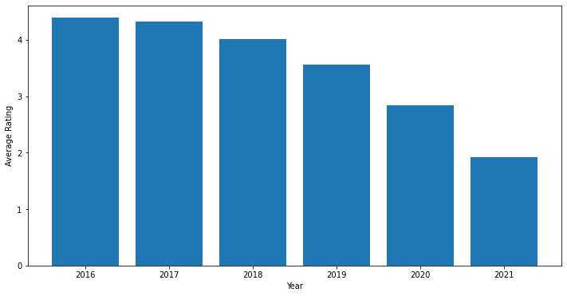
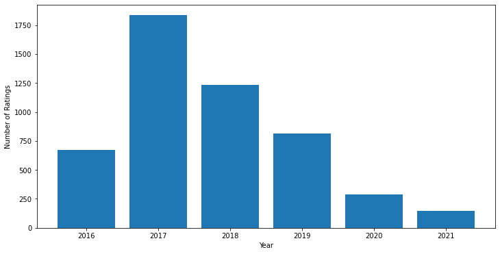
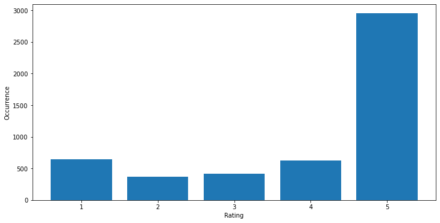
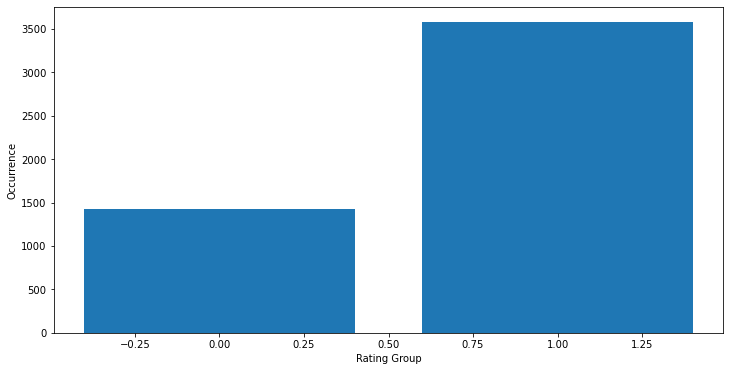

What follows is a script written to scrape TripAdvisor reviews, followed by a notebook that uses that data and machine learning to identify what guests mention as the most impactful positive and negative facets of Walt Disney World.

# You may also opt to read the web scraper script on IBM Cloud Pak for Data [here](https://dataplatform.cloud.ibm.com/analytics/notebooks/v2/467304c6-c8d7-4251-924e-fc4821bf5ffb/view?access_token=3542508951891fe6860eb2705df22966d7fe70ec034b8cc71a2757d785126944) and the notebook containing the rest of the project [here.](https://dataplatform.cloud.ibm.com/analytics/notebooks/v2/daaae61a-20ed-46d7-b99b-2f9cad69d33d/view?access_token=99404477a90670195373a076cfe880cd7a6e5418eec56d7000d432833a66952c)

# TripAdvisor Reviews Scraping
The following script enables scraping a user-specified quantity of the most recent reviews for a specified attraction. This DataFrame can then be utilized in other projects. (Here, it is utilized to analyze Walt Disney World Reviews.)


```python
from bs4 import BeautifulSoup
import requests
from requests import get
import pandas as pd
```


```python
#URL of front page of TripAdvisor attraction (here is for Walt Disney World)
url = 'https://www.tripadvisor.com/Attraction_Review-g34515-d143394-Reviews-Walt_Disney_World_Resort-Orlando_Florida.html'

#Setting index of reviews scraped to 0
i=0
#number of reviews to scrape (will round up to nearest ten)
numberReviews = 5000
#This list will store reviews prior to conversion to a pandas dataframe 
reviewsList = list()
```


```python
#Creating a function for cleaning undesirable characters that are left when converting from BeautifulSoup to string
def cleanHTMLRelics(string):
    for char in ['[','\'','\"',']','<br/>']:
        string = string.replace(char,'')
    return string
```


```python
#Each iteration of this loop scrapes a page, then goes to the next page.
while(i<numberReviews):
    if(i%100==0):
        print('Beginning scrape of review: '+str(i))
    #Pulling from URL
    results = requests.get(url)

    soup = BeautifulSoup(results.text, 'html.parser')
    #Finding class containing Reviews
    soup = soup.find(attrs={"class":"_1c8_1ITO"})
    soup = soup.contents[:-1]

    #For each review, scrape the rating, title, contents and date, then assemble these into a list.
    for review in soup:
        
        #scraping rating
        ratingScore = review.find(attrs={"class":"zWXXYhVR"})
        ratingScore = str(ratingScore['aria-label']).split()[0]
        ratingScore = float(ratingScore)
        
        #scraping date
        reviewDate = review.find(attrs={"class":"DrjyGw-P _26S7gyB4 _1z-B2F-n _1dimhEoy"})
        reviewDate = str(reviewDate.contents)
        reviewDate = ' '.join(reviewDate.split()[1:])
        reviewDate = cleanHTMLRelics(reviewDate)
        
        #scraping review title and contents
        titleContents = review.find_all(attrs={"class":"_2tsgCuqy"})
        title=str(titleContents[0].contents)
        title=cleanHTMLRelics(title)
        
        contents = str(titleContents[1].contents)
        contents = cleanHTMLRelics(contents)
        
        reviewAsList = [ratingScore, reviewDate, title, contents]
        reviewsList.append(reviewAsList)

    i+=10
    #Change url to the page with next ten reviews.
    url = 'https://www.tripadvisor.com/Attraction_Review-g34515-d143394-Reviews-or'+str(i)+'-Walt_Disney_World_Resort-Orlando_Florida.html'
    
```

    Beginning scrape of review: 0
    Beginning scrape of review: 100
    Beginning scrape of review: 200
    Beginning scrape of review: 300
    Beginning scrape of review: 400
    Beginning scrape of review: 500
    Beginning scrape of review: 600
    Beginning scrape of review: 700
    Beginning scrape of review: 800
    Beginning scrape of review: 900
    Beginning scrape of review: 1000
    Beginning scrape of review: 1100
    Beginning scrape of review: 1200
    Beginning scrape of review: 1300
    Beginning scrape of review: 1400
    Beginning scrape of review: 1500
    Beginning scrape of review: 1600
    Beginning scrape of review: 1700
    Beginning scrape of review: 1800
    Beginning scrape of review: 1900
    Beginning scrape of review: 2000
    Beginning scrape of review: 2100
    Beginning scrape of review: 2200
    Beginning scrape of review: 2300
    Beginning scrape of review: 2400
    Beginning scrape of review: 2500
    Beginning scrape of review: 2600
    Beginning scrape of review: 2700
    Beginning scrape of review: 2800
    Beginning scrape of review: 2900
    Beginning scrape of review: 3000
    Beginning scrape of review: 3100
    Beginning scrape of review: 3200
    Beginning scrape of review: 3300
    Beginning scrape of review: 3400
    Beginning scrape of review: 3500
    Beginning scrape of review: 3600
    Beginning scrape of review: 3700
    Beginning scrape of review: 3800
    Beginning scrape of review: 3900
    Beginning scrape of review: 4000
    Beginning scrape of review: 4100
    Beginning scrape of review: 4200
    Beginning scrape of review: 4300
    Beginning scrape of review: 4400
    Beginning scrape of review: 4500
    Beginning scrape of review: 4600
    Beginning scrape of review: 4700
    Beginning scrape of review: 4800
    Beginning scrape of review: 4900
    


```python
#Converting reviewsList into a pandas dataframe
reviewsDF = pd.DataFrame(reviewsList, columns = ['Rating','Date','Title','Contents'])
#Saving dataframe to a csv
reviewsDF.to_csv('TripAdvisorReviews.csv')
```


```python

```

The notebook that follows contains the rest of the project

# Disney Reviews
This notebook utilizes data scraped from TripAdvisor to answer the question "What do reviewers specifically mention as positive or negative traits of Walt Disney World?" This is of value in that it would enable building upon points that reviewers respond well to and identifying problems that ought to be mitigated to curtail negative impressions. To answer this question, we will import the scraped reviews, and perform a cursory evaluation of the data to verify that it is sufficient for answering this use case. We will then pre-process the data and train a logistic regression model (which is ideal for this use case given its readability) to predict whether a given review will be broadly positive or negative, evaluate the model to confirm that it is picking up a signal regarding sentiment, and finally examine which terms the model finds most positive or negative, with the model's performance standing to provide confidence in our classification of those terms as such.


```python
%%capture
#Installing PySpark, TensorFlow and Keras

!pip install pyspark
```


```python
from pyspark import SparkContext, SparkConf
from pyspark.ml import Pipeline
from pyspark.ml.classification import LogisticRegression
from pyspark.ml.evaluation import BinaryClassificationEvaluator
from pyspark.ml.feature import CountVectorizer, IDF, Tokenizer, VectorAssembler
from pyspark.ml.tuning import CrossValidator, ParamGridBuilder
from pyspark.sql import SparkSession
from pyspark.sql.window import Window
import pyspark.sql.functions as func
from pyspark.sql.types import DateType, StringType, LongType
import matplotlib.pyplot as plt
import re


import os, types
import pandas as pd
from botocore.client import Config
import ibm_boto3

def __iter__(self): return 0
```


```python
#Creating SparkSession
sc = SparkContext.getOrCreate(SparkConf().setMaster("local[*]"))
spark = SparkSession.builder.getOrCreate()
```


```python
# @hidden_cell
```

## Continued ETL and Data Exploration
 First, we will import our dataset which consists of 5,000 scraped Walt Disney World reviews from TripAdvisor.


```python
# add missing __iter__ method, so pandas accepts body as file-like object
if not hasattr(body, "__iter__"): body.__iter__ = types.MethodType( __iter__, body )

reviewsDF = pd.read_csv(body)
reviewsDF.head()
reviewsDF = spark.createDataFrame(reviewsDF)
reviewsDF.printSchema()
```

    root
     |-- Unnamed: 0: long (nullable = true)
     |-- Rating: long (nullable = true)
     |-- Date: string (nullable = true)
     |-- Title: string (nullable = true)
     |-- Contents: string (nullable = true)
    
    

From the above output, one may notice that Date is currently cast as a string. We will reformat this and cast it as PySpark's datetype.


```python
#Creating a function for reformatting the Date column to conform to PySpark date type
def dateReformat(row):
    #Pulling the date from the row
    oldDate = row[2]
    oldDate = oldDate.split('-')
    #Creating a dictionary for converting month from a String to an int
    monthDictionary = {'Jan':1,'Feb':2,'Mar':3,
                      'Apr':4,'May':5,'Jun':6,
                      'Jul':7,'Aug':8,'Sep':9,
                      'Oct':10,'Nov':11,'Dec':12}
    oldDate[1] = monthDictionary[oldDate[1]]
    #Reformatting year from YY to YYYY.
    oldDate[2] = '20'+str(oldDate[2])
    #Assembling into YYYY-MM-DD
    newDate = oldDate[2]+'-'+str(oldDate[1])+'-'+oldDate[0]
    return row[0],row[1],newDate,row[3],row[4]

#Applying the function
reviewsDF = reviewsDF.rdd.map(lambda x: dateReformat(x)).toDF(['Index','Rating','Date','Title','Contents'])
#Converting from String to DateType
reviewsDF = reviewsDF.withColumn("Date", reviewsDF['Date'].cast(DateType()))
reviewsDF.show()
```

    +-----+------+----------+--------------------+--------------------+
    |Index|Rating|      Date|               Title|            Contents|
    +-----+------+----------+--------------------+--------------------+
    |    0|     2|2021-06-13|Non-Existent Cust...|We have made 3 tr...|
    |    1|     1|2021-06-12|   Worst Disney Trip|Worst Disney trip...|
    |    2|     4|2021-06-12| Best vacation place|Disney World the ...|
    |    3|     1|2021-06-09|      Discrimination|This park isn’t f...|
    |    4|     2|2021-06-06|Wait, do not retu...|Animal Kingdom Lo...|
    |    5|     2|2021-06-01|Disney needs to u...|I am a grandmothe...|
    |    6|     1|2021-05-28|Using Covid as an...|We travel to Disn...|
    |    7|     4|2021-05-25|        1st time...,|1st time visiting...|
    |    8|     1|2021-05-24|Customer service ...|Very bad experien...|
    |    9|     3|2021-05-24|30% capacity also...|Just got back fro...|
    |   10|     1|2021-05-23|The magic is gone...|Awful. Covid or n...|
    |   11|     1|2021-05-22|        Disappointed|Vacation not off ...|
    |   12|     1|2021-05-22|Dizney is dirty, ...|Dont waste your t...|
    |   13|     1|2021-05-21| my Disney nightmare|i am a disabled v...|
    |   14|     5|2021-05-19|Do your research ...|I have to laugh a...|
    |   15|     2|2021-05-17|Could have been b...|Not as good this ...|
    |   16|     1|2021-05-16|  Big disappointment|Maybe it is becau...|
    |   17|     1|2021-05-16|Inequality and po...|My parents and I ...|
    |   18|     2|2021-05-14|Not much fun at D...|Needs to be more ...|
    |   19|     1|2021-05-13|Do not waste your...|First time taking...|
    +-----+------+----------+--------------------+--------------------+
    only showing top 20 rows
    
    


```python
#Visualizing the average rating per year
ratingsTime = reviewsDF.select('Date','Rating')

def grabYear(x):
    #Pulling the date from the row
    x = str(x).split('-')
    return int(x[0])

grabYearUDF = func.udf(lambda x: grabYear(x), returnType=LongType())
ratingsTime = ratingsTime.withColumn('Year',grabYearUDF(ratingsTime.Date))

#Creating a window partitioning by Year
yearPartition = Window.partitionBy('Year').orderBy('Year')
#Appending the average rating per year to the DataFrame
avgPerYear = func.avg('Rating').over(yearPartition)
ratingsTime=ratingsTime.withColumn('Avg',avgPerYear)

ratingsTime.show()

ratingsTimeRDD=ratingsTime.rdd.map(lambda row:(row.Year, row.Avg))

yearResultArray = ratingsTimeRDD.map(lambda row: row[0]).collect()
avgResultArray = ratingsTimeRDD.map(lambda row: row[1]).collect()

fig, ax = plt.subplots(figsize=(12, 6))
plt.bar(yearResultArray, avgResultArray)
plt.xlabel("Year")
plt.ylabel("Average Rating")
plt.show()
```

    +----------+------+----+------------------+
    |      Date|Rating|Year|               Avg|
    +----------+------+----+------------------+
    |2021-06-13|     2|2021|1.9189189189189189|
    |2021-06-12|     1|2021|1.9189189189189189|
    |2021-06-12|     4|2021|1.9189189189189189|
    |2021-06-09|     1|2021|1.9189189189189189|
    |2021-06-06|     2|2021|1.9189189189189189|
    |2021-06-01|     2|2021|1.9189189189189189|
    |2021-05-28|     1|2021|1.9189189189189189|
    |2021-05-25|     4|2021|1.9189189189189189|
    |2021-05-24|     1|2021|1.9189189189189189|
    |2021-05-24|     3|2021|1.9189189189189189|
    |2021-05-23|     1|2021|1.9189189189189189|
    |2021-05-22|     1|2021|1.9189189189189189|
    |2021-05-22|     1|2021|1.9189189189189189|
    |2021-05-21|     1|2021|1.9189189189189189|
    |2021-05-19|     5|2021|1.9189189189189189|
    |2021-05-17|     2|2021|1.9189189189189189|
    |2021-05-16|     1|2021|1.9189189189189189|
    |2021-05-16|     1|2021|1.9189189189189189|
    |2021-05-14|     2|2021|1.9189189189189189|
    |2021-05-13|     1|2021|1.9189189189189189|
    +----------+------+----+------------------+
    only showing top 20 rows
    
    





The above is a visualization showing how the average rating per year of Walt Disney World has changed over time. Without further evidence, it is difficult to state whether this visualization actually captures a shift in how guests feel about the Resort or not. Alternative causes may include more cynical reviews across TripAdvisor, shifting conditions in Florida, among countless other potential causes. However, what we can infer from the above graph is that, on average, negative reviews will tend to be more recent than positive ones, which is something to consider when analyzing user sentiment.


```python
#Visualizing how many ratings were published per year
countPerYear = func.count('Rating').over(yearPartition)
ratingsTime=ratingsTime.withColumn('Count',countPerYear)

ratingsTime.show()

ratingsTimeRDD=ratingsTime.rdd.map(lambda row:(row.Year, row.Count))

yearResultArray = ratingsTimeRDD.map(lambda row: row[0]).collect()
countResultArray = ratingsTimeRDD.map(lambda row: row[1]).collect()

fig, ax = plt.subplots(figsize=(12, 6))
plt.bar(yearResultArray, countResultArray)
plt.xlabel("Year")
plt.ylabel("Number of Ratings")
plt.show()
```

    +----------+------+----+------------------+-----+
    |      Date|Rating|Year|               Avg|Count|
    +----------+------+----+------------------+-----+
    |2021-06-13|     2|2021|1.9189189189189189|  148|
    |2021-06-12|     1|2021|1.9189189189189189|  148|
    |2021-06-12|     4|2021|1.9189189189189189|  148|
    |2021-06-09|     1|2021|1.9189189189189189|  148|
    |2021-06-06|     2|2021|1.9189189189189189|  148|
    |2021-06-01|     2|2021|1.9189189189189189|  148|
    |2021-05-28|     1|2021|1.9189189189189189|  148|
    |2021-05-25|     4|2021|1.9189189189189189|  148|
    |2021-05-24|     1|2021|1.9189189189189189|  148|
    |2021-05-24|     3|2021|1.9189189189189189|  148|
    |2021-05-23|     1|2021|1.9189189189189189|  148|
    |2021-05-22|     1|2021|1.9189189189189189|  148|
    |2021-05-22|     1|2021|1.9189189189189189|  148|
    |2021-05-21|     1|2021|1.9189189189189189|  148|
    |2021-05-19|     5|2021|1.9189189189189189|  148|
    |2021-05-17|     2|2021|1.9189189189189189|  148|
    |2021-05-16|     1|2021|1.9189189189189189|  148|
    |2021-05-16|     1|2021|1.9189189189189189|  148|
    |2021-05-14|     2|2021|1.9189189189189189|  148|
    |2021-05-13|     1|2021|1.9189189189189189|  148|
    +----------+------+----+------------------+-----+
    only showing top 20 rows
    
    





The above visualization shows the number of ratings on TripAdvisor per year. Again, this graph cannot lead us to make many inferences about the actual number of guests visiting Walt Disney World. (Although, it is not much of a stretch to believe that the reduced numbers of guests in 2020 and 2021 may be due to the parks operating in a reduced capacity due to the COVID-19 pandemic.) The implication of the above visualization for our project is that most of the user reviews seem to come from 2017-2019. This means that captured trends will be most representative of these years. Given the lack of data from 2020 and 2021, there is not much that can be done to alleviate this.


```python
#Generating a bar chart visualizing how many of each rating were assigned.

#Creating a partition by rating and getting the number of times each occurs.
reviewPartition = Window.partitionBy('Rating')
countRatings = func.count('Title').over(reviewPartition)
#Appending number of times each rating occurs to the reviews DataFrame
ratingCount = reviewsDF.withColumn('CountRatings', countRatings)
#Collecting arrays for use in PyPlot.
resultRdd = ratingCount.rdd.map(lambda row:(row.Rating, row.CountRatings))
ratingResultArray = resultRdd.map(lambda ratingCount: ratingCount[0]).collect()
countResultArray = resultRdd.map(lambda ratingCount: ratingCount[1]).collect()
#Plotting.
fig, ax = plt.subplots(figsize=(12, 6))
plt.bar(ratingResultArray,countResultArray)
plt.xlabel("Rating")
plt.ylabel("Occurrence")
plt.show()
```





Above, one will find Ratings by Occurrence. It is worth noting that there are approximately 3,000 5-star reviews and approximately 600 4-star reviews, which seem to be the second-most common. This indicates an approximately 5:1 ratio, leaving our data heavily imbalanced. We could remedy this through a few different methods, each with distinct drawbacks. We could cut out the majority of 5-star reviews, in which case we would lose valuable insights into what positive things guests say about the resort. Alternatively, we could capture older reviews that are not 5-star, the disadvantage being that captured sentiment would become more outdated. Instead, we will opt to group our rating into 2 categories, positive (comprising 4 and 5-star reviews) and negative (comprising 1, 2, and 3-star reviews.) This will come at the cost of granularity and we will lose the ability to, for instance, explore what separates a 1-star review from a 2-star review.


```python
#Creating a binary classification of negative (0) or positive (1) reviews where any with 4 or 5 stars go to positive.
ratingGroupUDF = func.udf(lambda x: 0 if x<4 else 1, returnType = LongType())
reviewsDF = reviewsDF.withColumn('Rating', ratingGroupUDF(reviewsDF.Rating))

#Visualizing the distribution of negative to positive reviews.
ratingCount = reviewsDF.withColumn('CountRatings', countRatings)
#Collecting Arrays for use in PyPlot
resultRdd = ratingCount.rdd.map(lambda row:(row.Rating, row.CountRatings))
ratingResultArray = resultRdd.map(lambda ratingCount: ratingCount[0]).collect()
countResultArray = resultRdd.map(lambda ratingCount: ratingCount[1]).collect()
#Plotting.
fig, ax = plt.subplots(figsize=(12, 6))
plt.bar(ratingResultArray,countResultArray)
plt.xlabel("Rating Group")
plt.ylabel("Occurrence")
plt.show()
```





After grouping, the ratio between our groups is approximately 3500:1500 which simplifies to a little worse than 2:1. Grouping has made the data significantly more balanced than before.

In order to prepare our data for use in modeling, we will strip out any characters that are not alphanumeric, and convert all characters to lowercase. Without this step, for example, "magical", "Magical" and "magical." would be treated as three distinct terms in modeling. Now, they will properly be recognized as identical in meaning.


```python
#Making text lowercase and omitting characters that are not alpha-numeric.
#Creating a function to accomplish this
def cleanText(string):
    string = string.lower()
    string = re.sub("[^0-9a-z\s]+", "", string)
    return string

#Wrapping the above function in a UDF
cleanTextUDF = func.udf(lambda x: cleanText(x), returnType = StringType())
#Applying the UDF
reviewsDF = reviewsDF.withColumn('Title', cleanTextUDF(reviewsDF.Title))
reviewsDF = reviewsDF.withColumn('Contents', cleanTextUDF(reviewsDF.Contents))

reviewsDF.show()
```

    +-----+------+----------+--------------------+--------------------+
    |Index|Rating|      Date|               Title|            Contents|
    +-----+------+----------+--------------------+--------------------+
    |    0|     0|2021-06-13|nonexistent custo...|we have made 3 tr...|
    |    1|     0|2021-06-12|   worst disney trip|worst disney trip...|
    |    2|     1|2021-06-12| best vacation place|disney world the ...|
    |    3|     0|2021-06-09|      discrimination|this park isnt fo...|
    |    4|     0|2021-06-06|wait do not retur...|animal kingdom lo...|
    |    5|     0|2021-06-01|disney needs to u...|i am a grandmothe...|
    |    6|     0|2021-05-28|using covid as an...|we travel to disn...|
    |    7|     1|2021-05-25|            1st time|1st time visiting...|
    |    8|     0|2021-05-24|customer service ...|very bad experien...|
    |    9|     0|2021-05-24|30 capacity also ...|just got back fro...|
    |   10|     0|2021-05-23|the magic is gone...|awful covid or no...|
    |   11|     0|2021-05-22|        disappointed|vacation not off ...|
    |   12|     0|2021-05-22|dizney is dirty t...|dont waste your t...|
    |   13|     0|2021-05-21| my disney nightmare|i am a disabled v...|
    |   14|     1|2021-05-19|do your research ...|i have to laugh a...|
    |   15|     0|2021-05-17|could have been b...|not as good this ...|
    |   16|     0|2021-05-16|  big disappointment|maybe it is becau...|
    |   17|     0|2021-05-16|inequality and po...|my parents and i ...|
    |   18|     0|2021-05-14|not much fun at d...|needs to be more ...|
    |   19|     0|2021-05-13|do not waste your...|first time taking...|
    +-----+------+----------+--------------------+--------------------+
    only showing top 20 rows
    
    

Our objective, to map the coefficients in the equation that underlies a trained logistic regression model back to the terms they are describing, will be more easily-achievable if we only need to work with a single vocabulary of terms to tokens. This is achievable if we work with a single corpus of text (instead of separate corpuses for titles and contents of reviews.) So, we will create a separate DataFrame where titles and contents are combined into one column. We will aim to train two separate but similar pipelines against these two dataframes and, if combining titles and contents into a single corpus does not result in a significant impact to performance, we will proceed to evaluate and examine the single corpus model.


```python
#Creating an alternative DataFrame where 
singleCorpusUDF=func.udf(lambda x,y:x+' '+y, returnType = StringType())
singleCorpusDF = reviewsDF.withColumn('Text',singleCorpusUDF(reviewsDF.Title, reviewsDF.Contents))
singleCorpusDF = singleCorpusDF.drop('Title','Contents')
singleCorpusDF.show()
```

    +-----+------+----------+--------------------+
    |Index|Rating|      Date|                Text|
    +-----+------+----------+--------------------+
    |    0|     0|2021-06-13|nonexistent custo...|
    |    1|     0|2021-06-12|worst disney trip...|
    |    2|     1|2021-06-12|best vacation pla...|
    |    3|     0|2021-06-09|discrimination th...|
    |    4|     0|2021-06-06|wait do not retur...|
    |    5|     0|2021-06-01|disney needs to u...|
    |    6|     0|2021-05-28|using covid as an...|
    |    7|     1|2021-05-25|1st time 1st time...|
    |    8|     0|2021-05-24|customer service ...|
    |    9|     0|2021-05-24|30 capacity also ...|
    |   10|     0|2021-05-23|the magic is gone...|
    |   11|     0|2021-05-22|disappointed vaca...|
    |   12|     0|2021-05-22|dizney is dirty t...|
    |   13|     0|2021-05-21|my disney nightma...|
    |   14|     1|2021-05-19|do your research ...|
    |   15|     0|2021-05-17|could have been b...|
    |   16|     0|2021-05-16|big disappointmen...|
    |   17|     0|2021-05-16|inequality and po...|
    |   18|     0|2021-05-14|not much fun at d...|
    |   19|     0|2021-05-13|do not waste your...|
    +-----+------+----------+--------------------+
    only showing top 20 rows
    
    

## Logistic Regression Pre-Processing and Modeling
We will now create a pipeline that pre-processes and trains a logistic regression model to predict ratings against the DataFrame that features separate corpuses for the titles and contents of each review. First, we will split each title and contents into individual words, then we will ascribe each term a unique identifying token and transform each title and contents into a list of featured tokens and a count of how often each appears. Of note at this stage is that we will now exclude any terms that appear less than 6 times in our data. This runs the risk of losing valuable insights, but eliminates terms that are so rare as to be attributable to misspellings or extraordinarily niche concerns. Finally, we will apply a penalty to terms based on their frequency throughout the dataset. This is to capture the fact that words that appear many times in a single review but rarely across the whole dataset are likely of special importance to that review.


```python
#Creating a Pipeline for the Distinct Corpuses Model
#renaming Ratings to label
lrReviewsDF = reviewsDF.withColumn('label', reviewsDF.Rating)

#Splitting data into training and testing sets
train, test = lrReviewsDF.randomSplit([0.8,0.2])

#Breaking titles and contents into individual words.
titleTokenizer = Tokenizer(inputCol="Title", outputCol="TokenizedTitle")
contentTokenizer = Tokenizer(inputCol="Contents", outputCol="TokenizedContents")

#Converting to a vector of Token Counts.
#Here minDF is an important parameter for filtering out rare terms and misspellings without losing valuable insights.
titleCVectorizer = CountVectorizer(inputCol=titleTokenizer.getOutputCol(), outputCol="CVTitle", minDF=6)
contentCVectorizer = CountVectorizer(inputCol=contentTokenizer.getOutputCol(), outputCol="CVContents", minDF=6)

#Penalizing words that are common across reviews
titleIDF = IDF(inputCol=titleCVectorizer.getOutputCol(), outputCol = 'IDFTitle')
contentIDF = IDF(inputCol=contentCVectorizer.getOutputCol(), outputCol = 'IDFContents')

#Assembling into a single features vector
vectorAssembler = VectorAssembler(inputCols = [titleIDF.getOutputCol(), contentIDF.getOutputCol()], outputCol = "features")
```

We will incorporate Logistic Regression with a ParamGrid for tuning, and 4-fold cross validation.


```python
lr=LogisticRegression(maxIter=100)
#Assembling a Pipeline that culminates in Logistic Regression
lrPipeline =Pipeline(stages = [titleTokenizer, contentTokenizer, titleCVectorizer, contentCVectorizer, titleIDF, contentIDF, vectorAssembler, lr])


#Tuning the Logistic Regression Model
lrParamGrid = ParamGridBuilder().addGrid(lr.regParam, [0.1, 0.105, 0.11]).addGrid(lr.elasticNetParam, [0.0325, 0.05, 0.0675]).build()


lrModelBuilder = CrossValidator(estimator=lrPipeline,
                estimatorParamMaps = lrParamGrid,
               evaluator=BinaryClassificationEvaluator(),
               numFolds=4)

lrModel = lrModelBuilder.fit(train)
```

We will also construct a similar pipeline against the DataFrame with a single corpus wherein each review's title and contents are combined.


```python
#renaming Ratings to label
singleCorpusDF = singleCorpusDF.withColumn('label', singleCorpusDF.Rating)

#Splitting data into training and testing sets
scTrain, scTest = singleCorpusDF.randomSplit([0.8,0.2])

#Breaking titles and contents into individual words.
tokenizer = Tokenizer(inputCol="Text", outputCol="TokenizedText")

#Converting to a vector of Token Counts.
#Here minDF is an important parameter for filtering out rare terms and misspellings without losing valuable insights.
cVectorizer = CountVectorizer(inputCol=tokenizer.getOutputCol(), outputCol="CVText", minDF=6)

#Penalizing words that are common across reviews
iDF = IDF(inputCol=cVectorizer.getOutputCol(), outputCol = 'features')

```


```python
scLR=LogisticRegression(maxIter=100)
#Assembling a Pipeline that culminates in Logistic Regression
scLRPipeline =Pipeline(stages = [tokenizer, cVectorizer, iDF, scLR])


#Tuning the Logistic Regression Model
scLRParamGrid = ParamGridBuilder().addGrid(scLR.regParam, [0.1, 0.105, 0.11]).addGrid(scLR.elasticNetParam, [0.0325, 0.05, 0.0675]).build()


scLRModelBuilder = CrossValidator(estimator=scLRPipeline,
                estimatorParamMaps = scLRParamGrid,
               evaluator=BinaryClassificationEvaluator(),
               numFolds=4)

scLRModel = scLRModelBuilder.fit(scTrain)
```

## Evaluation


```python
#Running the model against the testing subset of the data
lrPrediction = lrModel.transform(test)
scLRPrediction = scLRModel.transform(scTest)

#Showing a sample of Ratings against predicted values
print('Distinct Corpuses:')
lrPrediction.select('Rating','prediction').show(10)
print('Single Corpus:')
scLRPrediction.select('Rating','prediction').show(10)

#Finding the AUCs
accuracy_evaluator = BinaryClassificationEvaluator(metricName = 'areaUnderROC')
accuracy = accuracy_evaluator.evaluate(lrPrediction)
print('Distinct Corpuses:',accuracy)
accuracy_evaluator = BinaryClassificationEvaluator(metricName = 'areaUnderROC')
accuracy = accuracy_evaluator.evaluate(scLRPrediction)
print('Single Corpus:',accuracy)
```

    Distinct Corpuses:
    +------+----------+
    |Rating|prediction|
    +------+----------+
    |     0|       1.0|
    |     0|       0.0|
    |     0|       0.0|
    |     0|       1.0|
    |     0|       0.0|
    |     1|       0.0|
    |     0|       0.0|
    |     0|       1.0|
    |     0|       1.0|
    |     1|       1.0|
    +------+----------+
    only showing top 10 rows
    
    Single Corpus:
    +------+----------+
    |Rating|prediction|
    +------+----------+
    |     0|       0.0|
    |     0|       0.0|
    |     0|       1.0|
    |     0|       1.0|
    |     0|       0.0|
    |     1|       1.0|
    |     0|       0.0|
    |     0|       0.0|
    |     0|       0.0|
    |     0|       1.0|
    +------+----------+
    only showing top 10 rows
    
    Distinct Corpuses: 0.9589349236241882
    Single Corpus: 0.9605877479409347
    

Both Pipelines result in very strong AUC scores. The single corpus actually scores slightly better than the distinct corpuses pipeline, but this is so minor that we cannot rule out the improvement being due to variation. However, the lack of a significant decrease in the single corpus' performance indicates that we may proceed to use it in further model evaluation and in checking the coefficients for each term.


```python
scLRPrediction.createOrReplaceTempView('df')

truePositive=spark.sql('SELECT COUNT(*) FROM df WHERE prediction=1 AND Rating=1').collect()[0]['count(1)']
falsePositive=spark.sql('SELECT COUNT(*) FROM df WHERE prediction=1 AND Rating=0').collect()[0]['count(1)']
falseNegative=spark.sql('SELECT COUNT(*) FROM df WHERE prediction=0 AND Rating=1').collect()[0]['count(1)']

print('Precision: ', truePositive/(truePositive+falsePositive))
print('Recall: ', truePositive/(truePositive+falseNegative))
```

    Precision:  0.8795944233206591
    Recall:  0.9774647887323944
    

Both precision and recall scores are excellent, with recall especially approaching a perfect score of 1. It is worth noting however, that precision is significantly lower than recall. This indicates that our model is prone to false-positive predictions. In terms of evaluating the coefficients associated with a given term, this may mean that either some terms that reflect a negative experience are not accurately captured by the model, or it may mean that some terms which do not in fact predict a positive user experience are inaccurately predicted as indicators of a positive review. However, with that advisement, given that both of these scores are still excellent, we may proceed to the final stage of the project.

Below, we check which parameters from the ParamGrid led to the best-performing model, which may be useful should further tuning be required.


```python
#Printing the best parameters from within our ParamGrid. This may be useful in updating the ParamGrid.
#Finding the best performing Pipeline from the CrossValidator
bestModel = scLRModel.bestModel

print('Best Reg Param:',bestModel.stages[-1].getRegParam())
print('Best Elastic Net Param:',bestModel.stages[-1].getElasticNetParam())
```

    Best Reg Param: 0.11
    Best Elastic Net Param: 0.0325
    

## Examination of Coefficients
It is worth noting that a sentiment prediction model as developed above is, on its own, of business value in its ability to allow predicting whether unlabeled written data regarding Walt Disney World is positive or negative. (This could be used, for example, for creating a dashboard monitoring how many positive and negative tweets are made about Walt Disney World.)

Our evaluation metrics have found our logistic regression model to adequately predict whether a given review is speaking positively (as in 4 or 5-star reviews) or negatively (as in 1, 2, or 3-star reviews) about the park. 
The mathematical equation that underlies our trained model essentially consists of a function that squashes the sum of a number of terms, where each term corresponds to one word observed in the training data, to be between 0 and 1. Each of these terms takes the count of how often the associated word appeared in a given review, punishes it based on how frequent that term is across the dataset, and then multiplies it by a coefficient. These coefficients were determined in training and, given that the model adequately predicts positive or negative review sentiment, we may be confident that higher coefficients tend to be ascribed to words indicative of satisfaction whereas lower coefficients are ascribed to ones that indicate a dissatisfied guest.

So, in order to solve our use case of what reviewers identify as positive or negative traits of Walt Disney World, we may find the highest and lowest of these coefficients and identify which words they are associated with. We will do so for the top and bottom 35 coefficients.


```python
#We will find the highest coefficients.
#Creating an empty dictionary which will eventually store mappings of coefficient indices to values
coeffDict = {}
coeff=0
cardinalityCoeff=len(bestModel.stages[-1].coefficients)
numToFind=35

print('Finding top', numToFind,'of',cardinalityCoeff,'Coefficients')
for i in range(0,cardinalityCoeff):
    coeff = bestModel.stages[-1].coefficients[i]
    #If we do not yet have 10 key-value pairs in dictionary, then append coefficient
    if len(coeffDict)<numToFind:
        coeffDict[i]=coeff
    #If we already have 10 key-value pairs, then if coefficient higher than the lowest in the dictionary:
    elif coeff>min(coeffDict.values()):
        #Get rid of the lowest and add the new coefficient
        coeffDict.pop(min(coeffDict, key=coeffDict.get))
        coeffDict[i]=coeff
    if i%1000==0:
        print('Progress:',i,'coefficients of',cardinalityCoeff)
print('Finished.')

```

    Finding top 35 of 3917 Coefficients
    Progress: 0 coefficients of 3917
    Progress: 1000 coefficients of 3917
    Progress: 2000 coefficients of 3917
    Progress: 3000 coefficients of 3917
    Finished.
    

Once words that appeared less than 6 times were removed, the logistic regression model consisted of 3917 coefficients. We have mapped the 35 highest to the corresponding tokenized words.


```python
#We will find the lowest coefficients.
#Creating an empty dictionary which will eventually store mappings of coefficient indices to values
negCoeffDict = {}
coeff=0
cardinalityCoeff=len(bestModel.stages[-1].coefficients)

print('Finding bottom', numToFind,'of',cardinalityCoeff,'Coefficients')
for i in range(0,cardinalityCoeff):
    coeff = bestModel.stages[-1].coefficients[i]
    #If we do not yet have 10 key-value pairs in dictionary, then append coefficient
    if len(negCoeffDict)<numToFind:
        negCoeffDict[i]=coeff
    #If we already have 10 key-value pairs, then if coefficient higher than the lowest in the dictionary:
    elif coeff<max(negCoeffDict.values()):
        #Get rid of the lowest and add the new coefficient
        negCoeffDict.pop(max(negCoeffDict, key=negCoeffDict.get))
        negCoeffDict[i]=coeff
    if i%1000==0:
        print('Progress:',i,'coefficients of',cardinalityCoeff)
print('Finished.')
```

    Finding bottom 35 of 3917 Coefficients
    Progress: 0 coefficients of 3917
    Progress: 1000 coefficients of 3917
    Progress: 2000 coefficients of 3917
    Progress: 3000 coefficients of 3917
    Finished.
    

We have now done the same for the lowest 35 coefficients. As one can see below, it remains to map the tokenized words (expressed as unique integers) back to the actual words that they represent 


```python
print(coeffDict)
print(negCoeffDict)
```

    {47: 0.06624118160756581, 54: 0.152262092581842, 87: 0.0785519839715352, 90: 0.06886821322407699, 110: 0.11160714393416504, 112: 0.10697794328327295, 120: 0.1021473199332767, 121: 0.0883058410285006, 174: 0.07901261346529552, 196: 0.0952361809106178, 210: 0.09158880038105148, 263: 0.0759040760869943, 288: 0.06506467915689497, 345: 0.0734918826853412, 349: 0.07405987690531134, 370: 0.09232021840055418, 402: 0.09082638768365145, 479: 0.07804137217826171, 764: 0.09114070692201069, 782: 0.0876190544849739, 1182: 0.06914304609459088, 2265: 0.06481557298552067, 2274: 0.1437822128173443, 2442: 0.07550173759438572, 2588: 0.07526039459359313, 3231: 0.06810210577240468, 3298: 0.08611273175960425, 3355: 0.06469306865878038, 3421: 0.10211159231526294, 3437: 0.06904119862632221, 3451: 0.09113443869718571, 3482: 0.0758924699097016, 3628: 0.06658013063841275, 3639: 0.06809449617433146, 3760: 0.07667941490108769}
    {109: -0.13816849865063913, 199: -0.11081612717559289, 292: -0.13487763934957644, 457: -0.19332851128586867, 550: -0.14784273732753142, 568: -0.15581069577190082, 637: -0.13556357690430326, 669: -0.16421359237794406, 689: -0.13497103575445915, 716: -0.11201926721558189, 772: -0.12690380322793016, 984: -0.1379245425855393, 988: -0.12545695552476877, 998: -0.12699891777688355, 1177: -0.10669898631518482, 1286: -0.10377207123514016, 1287: -0.11018241414976117, 1380: -0.15444115330764807, 1450: -0.14489153188117576, 1881: -0.18403353799409933, 2089: -0.10311153295300413, 2334: -0.11712112334814, 2379: -0.10483446619845592, 2510: -0.14035694994758657, 2546: -0.11893660713882802, 2970: -0.17806634193023452, 3101: -0.14585890470071897, 3197: -0.1172512878392022, 3387: -0.16895037605206256, 3455: -0.1208877106831035, 3484: -0.13332695250057267, 3574: -0.10887754097599103, 3768: -0.1251965996701164, 3808: -0.15609348549664218, 3902: -0.12349066684551799}
    


```python
#Creating a dataframe mapping the strongly positive tokenized values to respective terms.
vocabList = list()
term = ''
vocabLength=len(bestModel.stages[1].vocabulary)

for key in coeffDict.keys():
    vocabRow = list()
    term = bestModel.stages[1].vocabulary[key]
    vocabRow = [key, coeffDict[key], term]
    vocabList.append(vocabRow)

coeffDF = pd.DataFrame(vocabList, columns = ['TokenizedKey','Coefficient','Term'])
coeffDF.sort_values(by='Coefficient', ascending=False)
```


<div>
<style scoped>
    .dataframe tbody tr th:only-of-type {
        vertical-align: middle;
    }

    .dataframe tbody tr th {
        vertical-align: top;
    }

    .dataframe thead th {
        text-align: right;
    }
</style>
<table border="1" class="dataframe">
  <thead>
    <tr style="text-align: right;">
      <th></th>
      <th>TokenizedKey</th>
      <th>Coefficient</th>
      <th>Term</th>
    </tr>
  </thead>
  <tbody>
    <tr>
      <th>1</th>
      <td>54</td>
      <td>0.152262</td>
      <td>great</td>
    </tr>
    <tr>
      <th>22</th>
      <td>2274</td>
      <td>0.143782</td>
      <td>ruin</td>
    </tr>
    <tr>
      <th>4</th>
      <td>110</td>
      <td>0.111607</td>
      <td>amazing</td>
    </tr>
    <tr>
      <th>5</th>
      <td>112</td>
      <td>0.106978</td>
      <td>always</td>
    </tr>
    <tr>
      <th>6</th>
      <td>120</td>
      <td>0.102147</td>
      <td>best</td>
    </tr>
    <tr>
      <th>28</th>
      <td>3421</td>
      <td>0.102112</td>
      <td>timeless</td>
    </tr>
    <tr>
      <th>9</th>
      <td>196</td>
      <td>0.095236</td>
      <td>loved</td>
    </tr>
    <tr>
      <th>15</th>
      <td>370</td>
      <td>0.092320</td>
      <td>fantastic</td>
    </tr>
    <tr>
      <th>10</th>
      <td>210</td>
      <td>0.091589</td>
      <td>wonderful</td>
    </tr>
    <tr>
      <th>18</th>
      <td>764</td>
      <td>0.091141</td>
      <td>blast</td>
    </tr>
    <tr>
      <th>30</th>
      <td>3451</td>
      <td>0.091134</td>
      <td>averaged</td>
    </tr>
    <tr>
      <th>16</th>
      <td>402</td>
      <td>0.090826</td>
      <td>ages</td>
    </tr>
    <tr>
      <th>7</th>
      <td>121</td>
      <td>0.088306</td>
      <td>love</td>
    </tr>
    <tr>
      <th>19</th>
      <td>782</td>
      <td>0.087619</td>
      <td>advantage</td>
    </tr>
    <tr>
      <th>26</th>
      <td>3298</td>
      <td>0.086113</td>
      <td>justice</td>
    </tr>
    <tr>
      <th>8</th>
      <td>174</td>
      <td>0.079013</td>
      <td>everyone</td>
    </tr>
    <tr>
      <th>2</th>
      <td>87</td>
      <td>0.078552</td>
      <td>magical</td>
    </tr>
    <tr>
      <th>17</th>
      <td>479</td>
      <td>0.078041</td>
      <td>excellent</td>
    </tr>
    <tr>
      <th>34</th>
      <td>3760</td>
      <td>0.076679</td>
      <td>billions</td>
    </tr>
    <tr>
      <th>11</th>
      <td>263</td>
      <td>0.075904</td>
      <td>enjoyed</td>
    </tr>
    <tr>
      <th>31</th>
      <td>3482</td>
      <td>0.075892</td>
      <td>clock</td>
    </tr>
    <tr>
      <th>23</th>
      <td>2442</td>
      <td>0.075502</td>
      <td>spaces</td>
    </tr>
    <tr>
      <th>24</th>
      <td>2588</td>
      <td>0.075260</td>
      <td>costly</td>
    </tr>
    <tr>
      <th>14</th>
      <td>349</td>
      <td>0.074060</td>
      <td>awesome</td>
    </tr>
    <tr>
      <th>13</th>
      <td>345</td>
      <td>0.073492</td>
      <td>helpful</td>
    </tr>
    <tr>
      <th>20</th>
      <td>1182</td>
      <td>0.069143</td>
      <td>longest</td>
    </tr>
    <tr>
      <th>29</th>
      <td>3437</td>
      <td>0.069041</td>
      <td>sore</td>
    </tr>
    <tr>
      <th>3</th>
      <td>90</td>
      <td>0.068868</td>
      <td>fun</td>
    </tr>
    <tr>
      <th>25</th>
      <td>3231</td>
      <td>0.068102</td>
      <td>politely</td>
    </tr>
    <tr>
      <th>33</th>
      <td>3639</td>
      <td>0.068094</td>
      <td>target</td>
    </tr>
    <tr>
      <th>32</th>
      <td>3628</td>
      <td>0.066580</td>
      <td>conversation</td>
    </tr>
    <tr>
      <th>0</th>
      <td>47</td>
      <td>0.066241</td>
      <td>place</td>
    </tr>
    <tr>
      <th>12</th>
      <td>288</td>
      <td>0.065065</td>
      <td>truly</td>
    </tr>
    <tr>
      <th>21</th>
      <td>2265</td>
      <td>0.064816</td>
      <td>excessive</td>
    </tr>
    <tr>
      <th>27</th>
      <td>3355</td>
      <td>0.064693</td>
      <td>musical</td>
    </tr>
  </tbody>
</table>
</div>


Above, one will find the 35 highest coefficients assigned by our model. Interpreting these is largely subjective. With that said, it is my position that this data indicates positive reviews come from those who are won over by the culture fostered by Walt Disney World. "Timeless," "magical," "ages," and "longest" suggest reviewers felt won over by a sense of warm nostalgia for the resort, something that could be continuously attended to in the future. Similarly, "helpful," "politely" and "conversation" seem to suggest that the resort's focus on customer service and retaining friendly cast members is a hit among guests that is worth continuing. Finally, it may be worth noting the inclusion of abstractions such as "justice," and "love" potentially indicating that guests view the park not only as a vacation destination but also as the embodiment of an ideal.


```python
#Doing the same for strongly negative terms.
negativeVocabList = list()

for key in negCoeffDict.keys():
    vocabRow = list()
    term = bestModel.stages[1].vocabulary[key]
    vocabRow = [key, negCoeffDict[key], term]
    negativeVocabList.append(vocabRow)

negCoeffDF = pd.DataFrame(negativeVocabList, columns = ['TokenizedKey','Coefficient','Term'])
negCoeffDF.sort_values(by='Coefficient', ascending=True)
```


<div>
<style scoped>
    .dataframe tbody tr th:only-of-type {
        vertical-align: middle;
    }

    .dataframe tbody tr th {
        vertical-align: top;
    }

    .dataframe thead th {
        text-align: right;
    }
</style>
<table border="1" class="dataframe">
  <thead>
    <tr style="text-align: right;">
      <th></th>
      <th>TokenizedKey</th>
      <th>Coefficient</th>
      <th>Term</th>
    </tr>
  </thead>
  <tbody>
    <tr>
      <th>3</th>
      <td>457</td>
      <td>-0.193329</td>
      <td>waste</td>
    </tr>
    <tr>
      <th>19</th>
      <td>1881</td>
      <td>-0.184034</td>
      <td>ripoff</td>
    </tr>
    <tr>
      <th>25</th>
      <td>2970</td>
      <td>-0.178066</td>
      <td>spontaneity</td>
    </tr>
    <tr>
      <th>28</th>
      <td>3387</td>
      <td>-0.168950</td>
      <td>tasted</td>
    </tr>
    <tr>
      <th>7</th>
      <td>669</td>
      <td>-0.164214</td>
      <td>terrible</td>
    </tr>
    <tr>
      <th>33</th>
      <td>3808</td>
      <td>-0.156093</td>
      <td>tech</td>
    </tr>
    <tr>
      <th>5</th>
      <td>568</td>
      <td>-0.155811</td>
      <td>disappointing</td>
    </tr>
    <tr>
      <th>17</th>
      <td>1380</td>
      <td>-0.154441</td>
      <td>overrated</td>
    </tr>
    <tr>
      <th>4</th>
      <td>550</td>
      <td>-0.147843</td>
      <td>worst</td>
    </tr>
    <tr>
      <th>26</th>
      <td>3101</td>
      <td>-0.145859</td>
      <td>sweat</td>
    </tr>
    <tr>
      <th>18</th>
      <td>1450</td>
      <td>-0.144892</td>
      <td>greed</td>
    </tr>
    <tr>
      <th>23</th>
      <td>2510</td>
      <td>-0.140357</td>
      <td>horrendous</td>
    </tr>
    <tr>
      <th>0</th>
      <td>109</td>
      <td>-0.138168</td>
      <td>money</td>
    </tr>
    <tr>
      <th>11</th>
      <td>984</td>
      <td>-0.137925</td>
      <td>dated</td>
    </tr>
    <tr>
      <th>6</th>
      <td>637</td>
      <td>-0.135564</td>
      <td>sad</td>
    </tr>
    <tr>
      <th>8</th>
      <td>689</td>
      <td>-0.134971</td>
      <td>horrible</td>
    </tr>
    <tr>
      <th>2</th>
      <td>292</td>
      <td>-0.134878</td>
      <td>disappointed</td>
    </tr>
    <tr>
      <th>30</th>
      <td>3484</td>
      <td>-0.133327</td>
      <td>sooooo</td>
    </tr>
    <tr>
      <th>13</th>
      <td>998</td>
      <td>-0.126999</td>
      <td>joke</td>
    </tr>
    <tr>
      <th>10</th>
      <td>772</td>
      <td>-0.126904</td>
      <td>sorry</td>
    </tr>
    <tr>
      <th>12</th>
      <td>988</td>
      <td>-0.125457</td>
      <td>today</td>
    </tr>
    <tr>
      <th>32</th>
      <td>3768</td>
      <td>-0.125197</td>
      <td>dodge</td>
    </tr>
    <tr>
      <th>34</th>
      <td>3902</td>
      <td>-0.123491</td>
      <td>210</td>
    </tr>
    <tr>
      <th>29</th>
      <td>3455</td>
      <td>-0.120888</td>
      <td>dime</td>
    </tr>
    <tr>
      <th>24</th>
      <td>2546</td>
      <td>-0.118937</td>
      <td>stopping</td>
    </tr>
    <tr>
      <th>27</th>
      <td>3197</td>
      <td>-0.117251</td>
      <td>precautions</td>
    </tr>
    <tr>
      <th>21</th>
      <td>2334</td>
      <td>-0.117121</td>
      <td>guard</td>
    </tr>
    <tr>
      <th>9</th>
      <td>716</td>
      <td>-0.112019</td>
      <td>overcrowded</td>
    </tr>
    <tr>
      <th>1</th>
      <td>199</td>
      <td>-0.110816</td>
      <td>hour</td>
    </tr>
    <tr>
      <th>16</th>
      <td>1287</td>
      <td>-0.110182</td>
      <td>boring</td>
    </tr>
    <tr>
      <th>31</th>
      <td>3574</td>
      <td>-0.108878</td>
      <td>cheesy</td>
    </tr>
    <tr>
      <th>14</th>
      <td>1177</td>
      <td>-0.106699</td>
      <td>nightmare</td>
    </tr>
    <tr>
      <th>22</th>
      <td>2379</td>
      <td>-0.104834</td>
      <td>police</td>
    </tr>
    <tr>
      <th>15</th>
      <td>1286</td>
      <td>-0.103772</td>
      <td>rip</td>
    </tr>
    <tr>
      <th>20</th>
      <td>2089</td>
      <td>-0.103112</td>
      <td>ridiculously</td>
    </tr>
  </tbody>
</table>
</div>


Above one will find the words corresponding to the 35 lowest coefficients. Again, interpreting these is an exercise in subjectivity. It would appear that, based on words such as "greed," "waste," "ripoff," and "money" frustration exists with the price of the resort. However, the word "overcrowded" is also featured in this list, a problem which reducing fees would only exacerbate. "Disappointing," "disappointed" and "overrated" are all present, which may indicate that some had a different expectation of the resort. This may warrant investigating what potential guests expect their trip to be like and how Walt Disney World can clarify any misconceptions regarding its offerings. Finally, "sweat" is also present among the most negative words. While there is not much to be done about the Florida heat, Walt Disney World has many offerings with either air conditioning, water sprays, or cool mist. The presence of this term could warrant an investigation into which of these methods of cooling guests is most effective and whether any areas of the resort are underserviced.


```python

```
